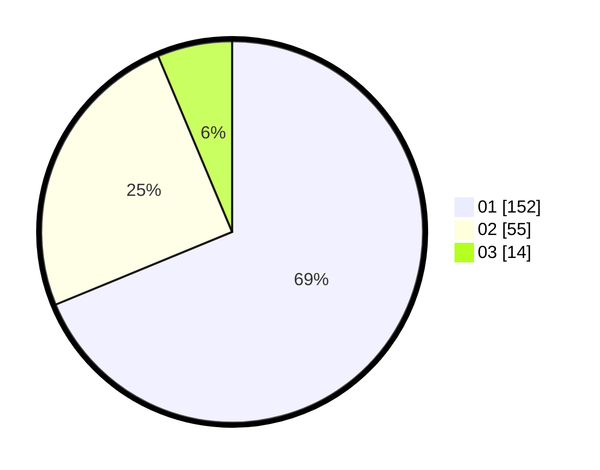

# Hasil

Hasil perolehan suara paslon dapat dilihat pada file paslon-01.txt, paslon-02.txt, dan paslon-03.txt.

Jika tidak ada, artinya data tersebut belum ada pada SIREKAP.

## Perolehan Suara

 * Paslon 01: **152**.
 * Paslon 02: **55**.
 * Paslon 03: **14**.

## Foto C Plano

https://sirekap-obj-formc.kpu.go.id/c29c/pemilu/ppwp/31/73/01/10/02/3173011002078-20240214-195118--806d8cee-5642-4872-b720-574ace621b6d.jpg

https://sirekap-obj-formc.kpu.go.id/c29c/pemilu/ppwp/31/73/01/10/02/3173011002078-20240214-201355--b457ec09-5dc6-40d2-82ce-f528387a2c6c.jpg

https://sirekap-obj-formc.kpu.go.id/c29c/pemilu/ppwp/31/73/01/10/02/3173011002078-20240214-210539--c1df7822-b5bf-4844-b72b-1631d1807975.jpg

## DATA PEMILIH TETAP

Jumlah pemilih dalam DPT: **266**.
 * L: **129**.
 * P: **137**.

## DATA PENGGUNA HAK PILIH

Jumlah pengguna hak pilih dalam DPT: **222**.
 * L: **102**.
 * P: **120**.

Jumlah pengguna hak pilih dalam DPTb: **11**.
 * L: **6**.
 * P: **5**.

Jumlah pengguna hak pilih dalam DPK: **3**.
 * L: **2**.
 * P: **1**.

Jumlah pengguna hak pilih: **236**.
 * L: **110**.
 * P: **126**.

## JUMLAH SUARA SAH DAN TIDAK SAH

JUMLAH SELURUH SUARA SAH: **232**.

JUMLAH SUARA TIDAK SAH: **4**.

JUMLAH SELURUH SUARA SAH DAN SUARA TIDAK SAH: **236**.
