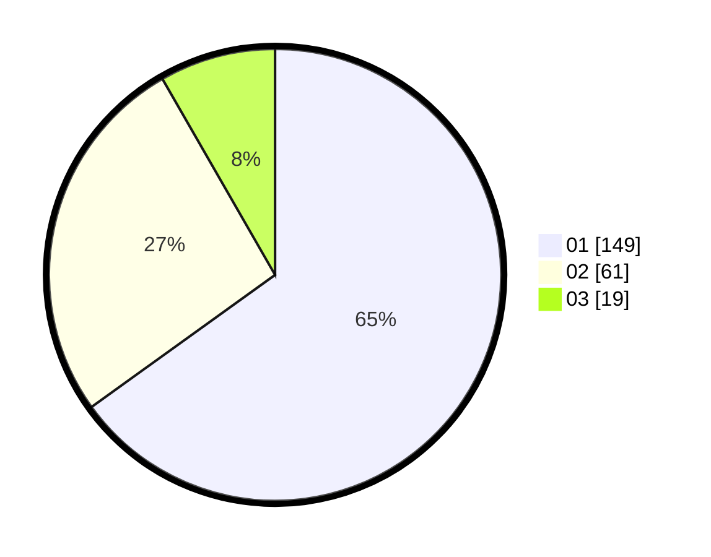

# Hasil

Hasil perolehan suara paslon dapat dilihat pada file paslon-01.txt, paslon-02.txt, dan paslon-03.txt.

Jika tidak ada, artinya data tersebut belum ada pada SIREKAP.

## Perolehan Suara

 * Paslon 01: **149**.
 * Paslon 02: **61**.
 * Paslon 03: **19**.

## Foto C Plano

https://sirekap-obj-formc.kpu.go.id/98c2/pemilu/ppwp/31/73/01/10/02/3173011002079-20240214-231825--93caa02e-2902-433b-b72f-0fcfb7215a8a.jpg

https://sirekap-obj-formc.kpu.go.id/98c2/pemilu/ppwp/31/73/01/10/02/3173011002079-20240214-231627--e5eb5084-ad2e-4b5f-afca-1928f4d65ef3.jpg

https://sirekap-obj-formc.kpu.go.id/98c2/pemilu/ppwp/31/73/01/10/02/3173011002079-20240214-231732--e20dd2a3-265d-41b2-afa5-3212b6912805.jpg
