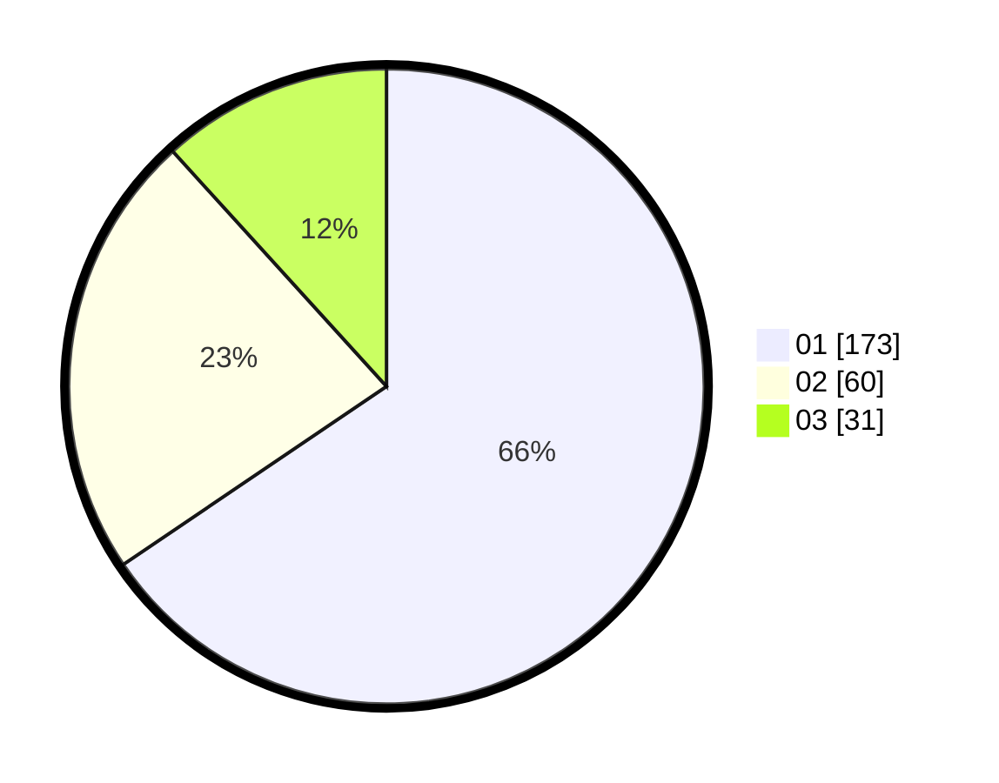

# Hasil

Hasil perolehan suara paslon dapat dilihat pada file paslon-01.txt, paslon-02.txt, dan paslon-03.txt.

Jika tidak ada, artinya data tersebut belum ada pada SIREKAP.

## Perolehan Suara

 * Paslon 01: **173**.
 * Paslon 02: **60**.
 * Paslon 03: **31**.

## Foto C Plano

https://sirekap-obj-formc.kpu.go.id/d65a/pemilu/ppwp/31/73/01/10/02/3173011002081-20240215-150401--0f837043-dfcb-4ced-a3bf-a21645e5d6d9.jpg

https://sirekap-obj-formc.kpu.go.id/d65a/pemilu/ppwp/31/73/01/10/02/3173011002081-20240215-150548--b4ec71ff-1d3f-4c2f-8fe8-9fc8d73a47ce.jpg

https://sirekap-obj-formc.kpu.go.id/d65a/pemilu/ppwp/31/73/01/10/02/3173011002081-20240215-150754--1c568647-3806-41e6-a2cd-8caa6856bc8f.jpg

## DATA PEMILIH TETAP

Jumlah pemilih dalam DPT: **269**.
 * L: **139**.
 * P: **130**.

## DATA PENGGUNA HAK PILIH

Jumlah pengguna hak pilih dalam DPT: **239**.
 * L: **123**.
 * P: **116**.

Jumlah pengguna hak pilih dalam DPTb: **13**.
 * L: **6**.
 * P: **7**.

Jumlah pengguna hak pilih dalam DPK: **12**.
 * L: **6**.
 * P: **6**.

Jumlah pengguna hak pilih: **264**.
 * L: **135**.
 * P: **129**.

## JUMLAH SUARA SAH DAN TIDAK SAH

JUMLAH SELURUH SUARA SAH: **264**.

JUMLAH SUARA TIDAK SAH: **0**.

JUMLAH SELURUH SUARA SAH DAN SUARA TIDAK SAH: **264**.
