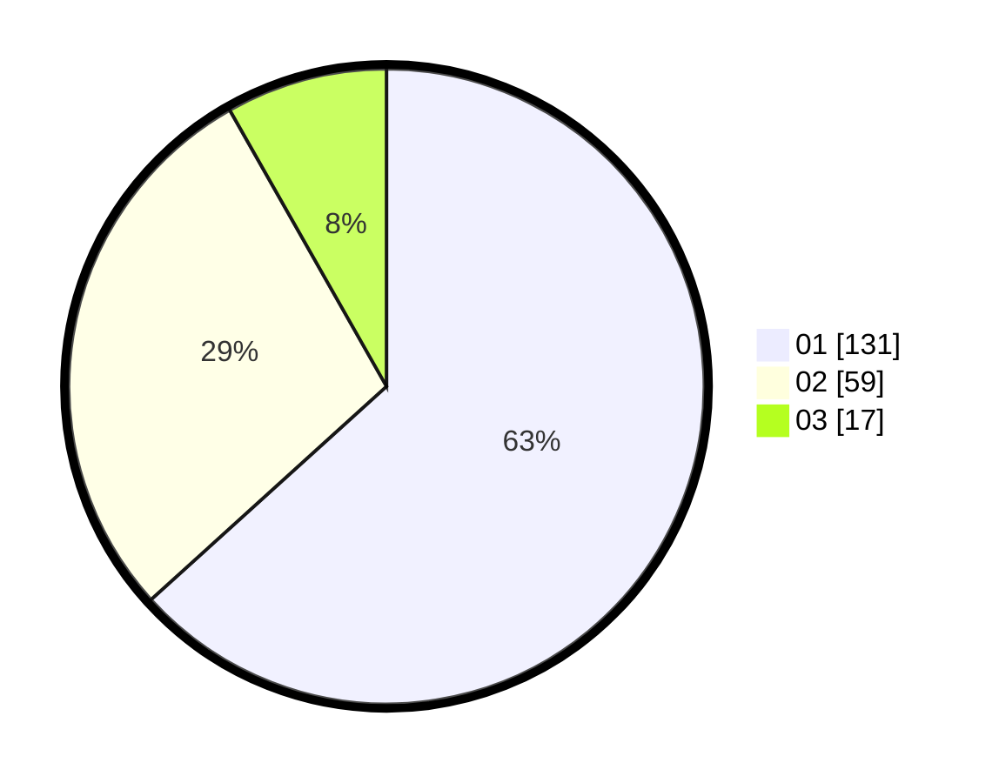

# Hasil

Hasil perolehan suara paslon dapat dilihat pada file paslon-01.txt, paslon-02.txt, dan paslon-03.txt.

Jika tidak ada, artinya data tersebut belum ada pada SIREKAP.

## Perolehan Suara

 * Paslon 01: **131**.
 * Paslon 02: **59**.
 * Paslon 03: **17**.

## Foto C Plano

https://sirekap-obj-formc.kpu.go.id/0724/pemilu/ppwp/31/73/01/10/02/3173011002082-20240214-215231--4deeaeb7-f94d-4394-aac0-f3e283748e66.jpg

https://sirekap-obj-formc.kpu.go.id/0724/pemilu/ppwp/31/73/01/10/02/3173011002082-20240214-215334--d2e3b546-b2e3-4f5d-ac6a-fad3692edab0.jpg

https://sirekap-obj-formc.kpu.go.id/0724/pemilu/ppwp/31/73/01/10/02/3173011002082-20240214-215406--3c0b6db8-3d87-4541-ab9e-417dcada8d92.jpg
