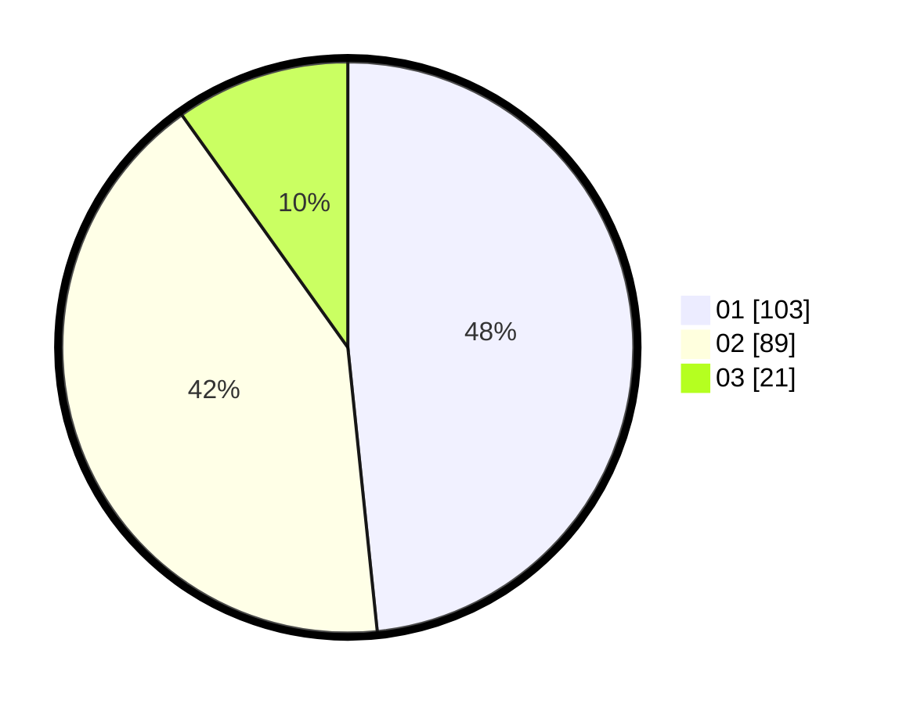

# Hasil

Hasil perolehan suara paslon dapat dilihat pada file paslon-01.txt, paslon-02.txt, dan paslon-03.txt.

Jika tidak ada, artinya data tersebut belum ada pada SIREKAP.

## Perolehan Suara

 * Paslon 01: **103**.
 * Paslon 02: **89**.
 * Paslon 03: **21**.

## Foto C Plano

https://sirekap-obj-formc.kpu.go.id/5e84/pemilu/ppwp/31/73/01/10/02/3173011002084-20240214-155025--b529eb45-a178-4076-82e5-9058516fed67.jpg

https://sirekap-obj-formc.kpu.go.id/5e84/pemilu/ppwp/31/73/01/10/02/3173011002084-20240214-155117--ce909c8e-070e-4e86-9da1-bf7546989ed7.jpg

https://sirekap-obj-formc.kpu.go.id/5e84/pemilu/ppwp/31/73/01/10/02/3173011002084-20240214-155204--ce208a16-8ceb-49e9-861d-147b5d1ac8a5.jpg

## DATA PEMILIH TETAP

Jumlah pemilih dalam DPT: **274**.
 * L: **132**.
 * P: **142**.

## DATA PENGGUNA HAK PILIH

Jumlah pengguna hak pilih dalam DPT: **213**.
 * L: **102**.
 * P: **111**.

Jumlah pengguna hak pilih dalam DPTb: **2**.
 * L: **1**.
 * P: **1**.

Jumlah pengguna hak pilih dalam DPK: **0**.
 * L: **0**.
 * P: **0**.

Jumlah pengguna hak pilih: **215**.
 * L: **103**.
 * P: **112**.

## JUMLAH SUARA SAH DAN TIDAK SAH

JUMLAH SELURUH SUARA SAH: **213**.

JUMLAH SUARA TIDAK SAH: **2**.

JUMLAH SELURUH SUARA SAH DAN SUARA TIDAK SAH: **215**.
