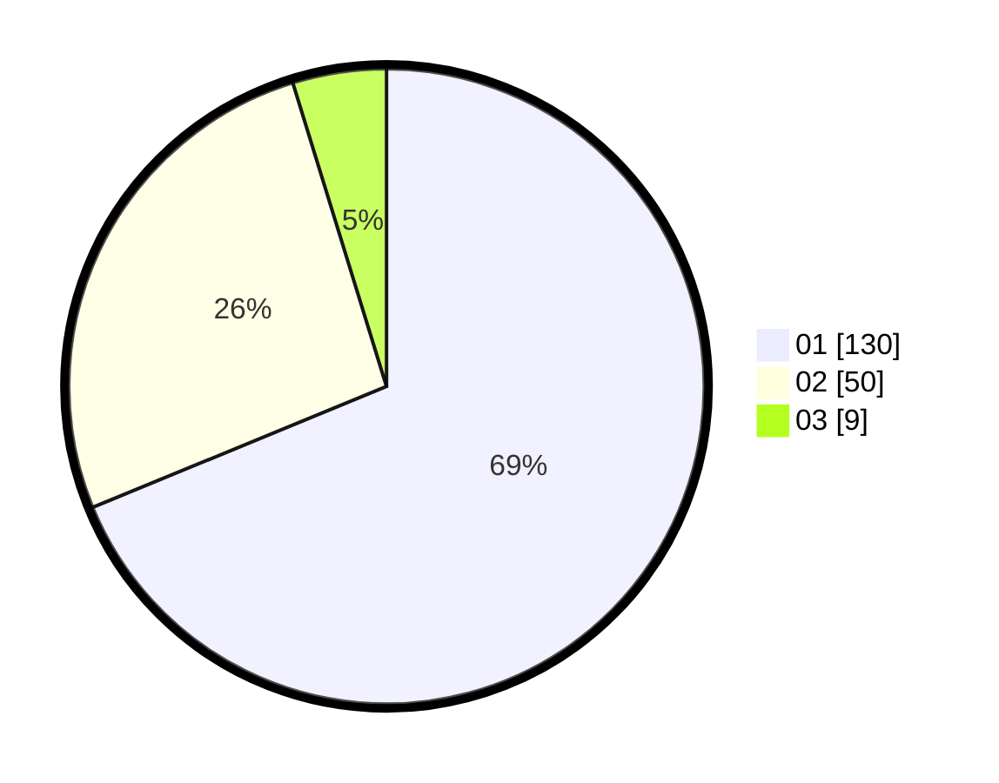

# Hasil

Hasil perolehan suara paslon dapat dilihat pada file paslon-01.txt, paslon-02.txt, dan paslon-03.txt.

Jika tidak ada, artinya data tersebut belum ada pada SIREKAP.

## Perolehan Suara

 * Paslon 01: **130**.
 * Paslon 02: **50**.
 * Paslon 03: **9**.

## Foto C Plano

https://sirekap-obj-formc.kpu.go.id/e9ce/pemilu/ppwp/31/73/01/10/02/3173011002089-20240214-195504--202f3f1c-2db8-409a-aa8b-49751699cbb8.jpg

https://sirekap-obj-formc.kpu.go.id/e9ce/pemilu/ppwp/31/73/01/10/02/3173011002089-20240214-195842--31cc49d9-54a0-456c-a120-27d68029c31b.jpg

https://sirekap-obj-formc.kpu.go.id/e9ce/pemilu/ppwp/31/73/01/10/02/3173011002089-20240214-200006--b4cfea2e-0f66-4167-a1cd-b356568152e8.jpg
