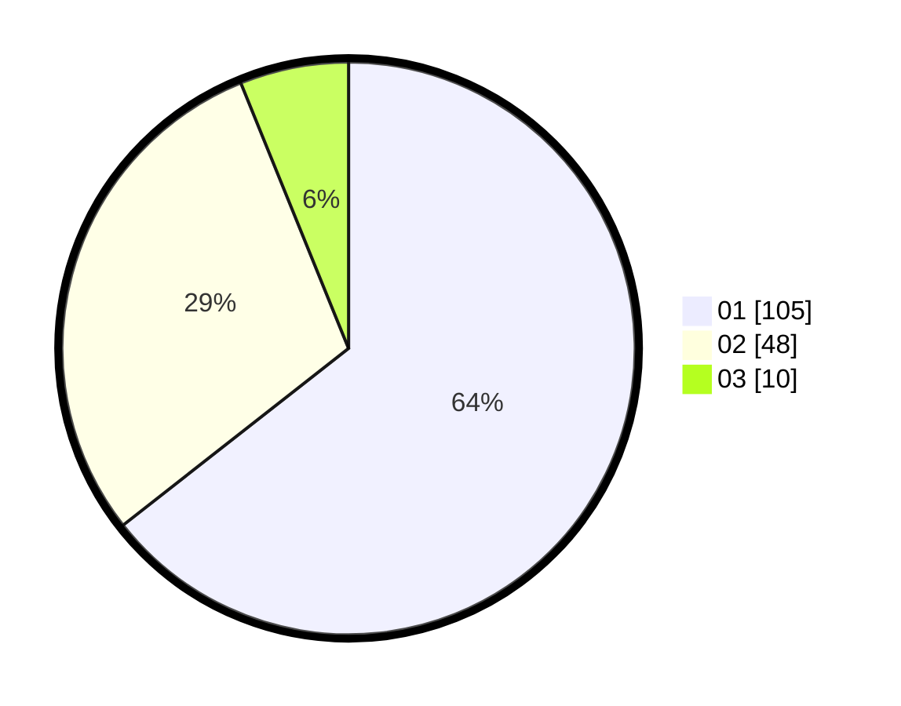

# Hasil

Hasil perolehan suara paslon dapat dilihat pada file paslon-01.txt, paslon-02.txt, dan paslon-03.txt.

Jika tidak ada, artinya data tersebut belum ada pada SIREKAP.

## Perolehan Suara

 * Paslon 01: **105**.
 * Paslon 02: **48**.
 * Paslon 03: **10**.

## Foto C Plano

https://sirekap-obj-formc.kpu.go.id/3381/pemilu/ppwp/31/73/01/10/02/3173011002090-20240216-015631--6da7e1eb-77cf-4975-893b-3163ababe402.jpg

https://sirekap-obj-formc.kpu.go.id/3381/pemilu/ppwp/31/73/01/10/02/3173011002090-20240216-083244--c83fb6e0-ac4e-4251-8f5f-00ce7df31010.jpg

https://sirekap-obj-formc.kpu.go.id/3381/pemilu/ppwp/31/73/01/10/02/3173011002090-20240216-015632--548d798e-7d83-46a1-8a79-a33280dd28e0.jpg

## DATA PEMILIH TETAP

Jumlah pemilih dalam DPT: **210**.
 * L: **106**.
 * P: **104**.

## DATA PENGGUNA HAK PILIH

Jumlah pengguna hak pilih dalam DPT: **167**.
 * L: **85**.
 * P: **82**.

Jumlah pengguna hak pilih dalam DPTb: **0**.
 * L: **0**.
 * P: **0**.

Jumlah pengguna hak pilih dalam DPK: **0**.
 * L: **0**.
 * P: **0**.

Jumlah pengguna hak pilih: **167**.
 * L: **85**.
 * P: **82**.

## JUMLAH SUARA SAH DAN TIDAK SAH

JUMLAH SELURUH SUARA SAH: **163**.

JUMLAH SUARA TIDAK SAH: **4**.

JUMLAH SELURUH SUARA SAH DAN SUARA TIDAK SAH: **167**.
