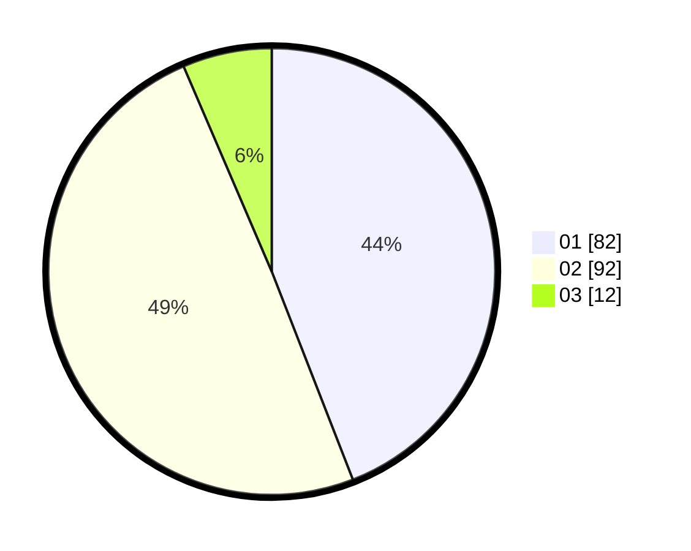

# Hasil

Hasil perolehan suara paslon dapat dilihat pada file paslon-01.txt, paslon-02.txt, dan paslon-03.txt.

Jika tidak ada, artinya data tersebut belum ada pada SIREKAP.

## Perolehan Suara

 * Paslon 01: **82**.
 * Paslon 02: **92**.
 * Paslon 03: **12**.

## Foto C Plano

https://sirekap-obj-formc.kpu.go.id/e01c/pemilu/ppwp/31/73/01/10/02/3173011002091-20240215-075935--21001384-e0fc-45d9-acee-0a9b876d6d7f.jpg

https://sirekap-obj-formc.kpu.go.id/e01c/pemilu/ppwp/31/73/01/10/02/3173011002091-20240216-135830--59deb878-5747-461a-81c1-0c03aab2ba7d.jpg

https://sirekap-obj-formc.kpu.go.id/e01c/pemilu/ppwp/31/73/01/10/02/3173011002091-20240216-135829--6073c7c8-e40b-4338-bdca-89f5b38c3238.jpg
