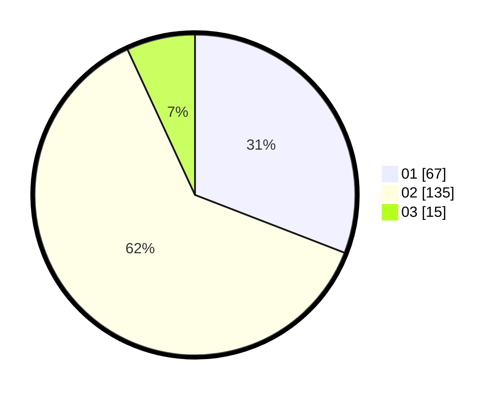

# Hasil

Hasil perolehan suara paslon dapat dilihat pada file paslon-01.txt, paslon-02.txt, dan paslon-03.txt.

Jika tidak ada, artinya data tersebut belum ada pada SIREKAP.

## Perolehan Suara

 * Paslon 01: **67**.
 * Paslon 02: **135**.
 * Paslon 03: **15**.

## Foto C Plano

https://sirekap-obj-formc.kpu.go.id/185b/pemilu/ppwp/31/73/01/10/02/3173011002096-20240214-203209--d6b1bfef-c662-4132-8c29-d88b0ef8f0db.jpg

https://sirekap-obj-formc.kpu.go.id/185b/pemilu/ppwp/31/73/01/10/02/3173011002096-20240214-203228--243fe702-e82e-48f7-8546-19009ad15817.jpg

https://sirekap-obj-formc.kpu.go.id/185b/pemilu/ppwp/31/73/01/10/02/3173011002096-20240214-203245--d1a7fce1-3793-4159-b8c6-d9941ef588f1.jpg

## DATA PEMILIH TETAP

Jumlah pemilih dalam DPT: **278**.
 * L: **131**.
 * P: **147**.

## DATA PENGGUNA HAK PILIH

Jumlah pengguna hak pilih dalam DPT: **222**.
 * L: **105**.
 * P: **117**.

Jumlah pengguna hak pilih dalam DPTb: **0**.
 * L: **0**.
 * P: **0**.

Jumlah pengguna hak pilih dalam DPK: **0**.
 * L: **0**.
 * P: **0**.

Jumlah pengguna hak pilih: **222**.
 * L: **105**.
 * P: **117**.

## JUMLAH SUARA SAH DAN TIDAK SAH

JUMLAH SELURUH SUARA SAH: **217**.

JUMLAH SUARA TIDAK SAH: **5**.

JUMLAH SELURUH SUARA SAH DAN SUARA TIDAK SAH: **222**.
