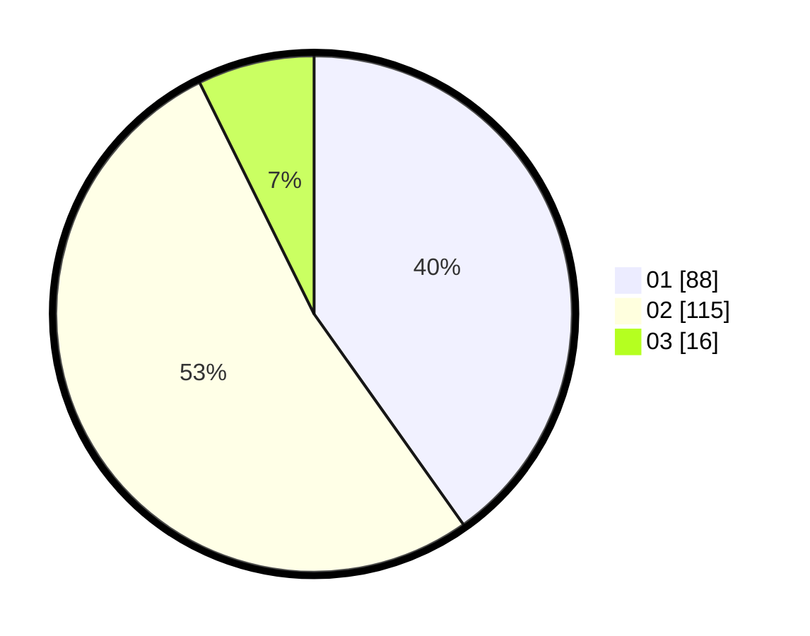

# Hasil

Hasil perolehan suara paslon dapat dilihat pada file paslon-01.txt, paslon-02.txt, dan paslon-03.txt.

Jika tidak ada, artinya data tersebut belum ada pada SIREKAP.

## Perolehan Suara

 * Paslon 01: **88**.
 * Paslon 02: **115**.
 * Paslon 03: **16**.

## Foto C Plano

https://sirekap-obj-formc.kpu.go.id/b589/pemilu/ppwp/31/73/01/10/02/3173011002100-20240216-155340--4dbb8942-e5c7-4c2e-9d59-2d42e83ce0e0.jpg

https://sirekap-obj-formc.kpu.go.id/b589/pemilu/ppwp/31/73/01/10/02/3173011002100-20240216-155342--14c95c51-2690-4290-a1b9-e53c67c79f44.jpg

https://sirekap-obj-formc.kpu.go.id/b589/pemilu/ppwp/31/73/01/10/02/3173011002100-20240216-155341--26475f50-99ed-45cb-940d-756cf7e40315.jpg

## DATA PEMILIH TETAP

Jumlah pemilih dalam DPT: **274**.
 * L: **138**.
 * P: **136**.

## DATA PENGGUNA HAK PILIH

Jumlah pengguna hak pilih dalam DPT: **219**.
 * L: **105**.
 * P: **114**.

Jumlah pengguna hak pilih dalam DPTb: **0**.
 * L: **0**.
 * P: **0**.

Jumlah pengguna hak pilih dalam DPK: **5**.
 * L: **2**.
 * P: **3**.

Jumlah pengguna hak pilih: **224**.
 * L: **107**.
 * P: **117**.

## JUMLAH SUARA SAH DAN TIDAK SAH

JUMLAH SELURUH SUARA SAH: **219**.

JUMLAH SUARA TIDAK SAH: **5**.

JUMLAH SELURUH SUARA SAH DAN SUARA TIDAK SAH: **224**.
