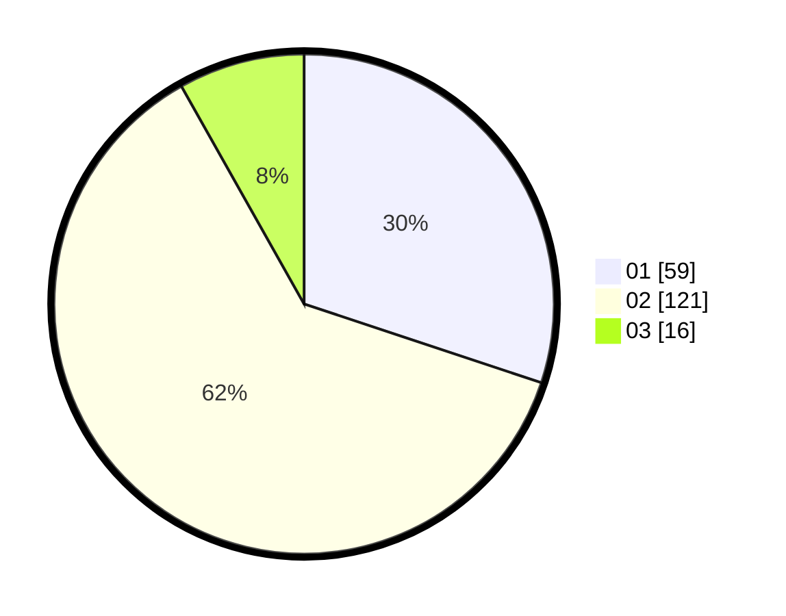

# Hasil

Hasil perolehan suara paslon dapat dilihat pada file paslon-01.txt, paslon-02.txt, dan paslon-03.txt.

Jika tidak ada, artinya data tersebut belum ada pada SIREKAP.

## Perolehan Suara

 * Paslon 01: **59**.
 * Paslon 02: **121**.
 * Paslon 03: **16**.

## Foto C Plano

https://sirekap-obj-formc.kpu.go.id/195f/pemilu/ppwp/31/73/01/10/02/3173011002102-20240216-124206--3b6d8abb-09ca-47e4-9ff1-752c235c2acb.jpg

https://sirekap-obj-formc.kpu.go.id/195f/pemilu/ppwp/31/73/01/10/02/3173011002102-20240216-124208--e7e6b07e-8121-4cd4-b2fc-6a65abd1f4aa.jpg

https://sirekap-obj-formc.kpu.go.id/195f/pemilu/ppwp/31/73/01/10/02/3173011002102-20240216-124207--f7813e6a-7b84-44e2-8e55-4011ad6c0f43.jpg

## DATA PEMILIH TETAP

Jumlah pemilih dalam DPT: **267**.
 * L: **137**.
 * P: **130**.

## DATA PENGGUNA HAK PILIH

Jumlah pengguna hak pilih dalam DPT: **199**.
 * L: **104**.
 * P: **95**.

Jumlah pengguna hak pilih dalam DPTb: **0**.
 * L: **0**.
 * P: **0**.

Jumlah pengguna hak pilih dalam DPK: **1**.
 * L: **1**.
 * P: **0**.

Jumlah pengguna hak pilih: **200**.
 * L: **105**.
 * P: **95**.

## JUMLAH SUARA SAH DAN TIDAK SAH

JUMLAH SELURUH SUARA SAH: **196**.

JUMLAH SUARA TIDAK SAH: **4**.

JUMLAH SELURUH SUARA SAH DAN SUARA TIDAK SAH: **200**.
