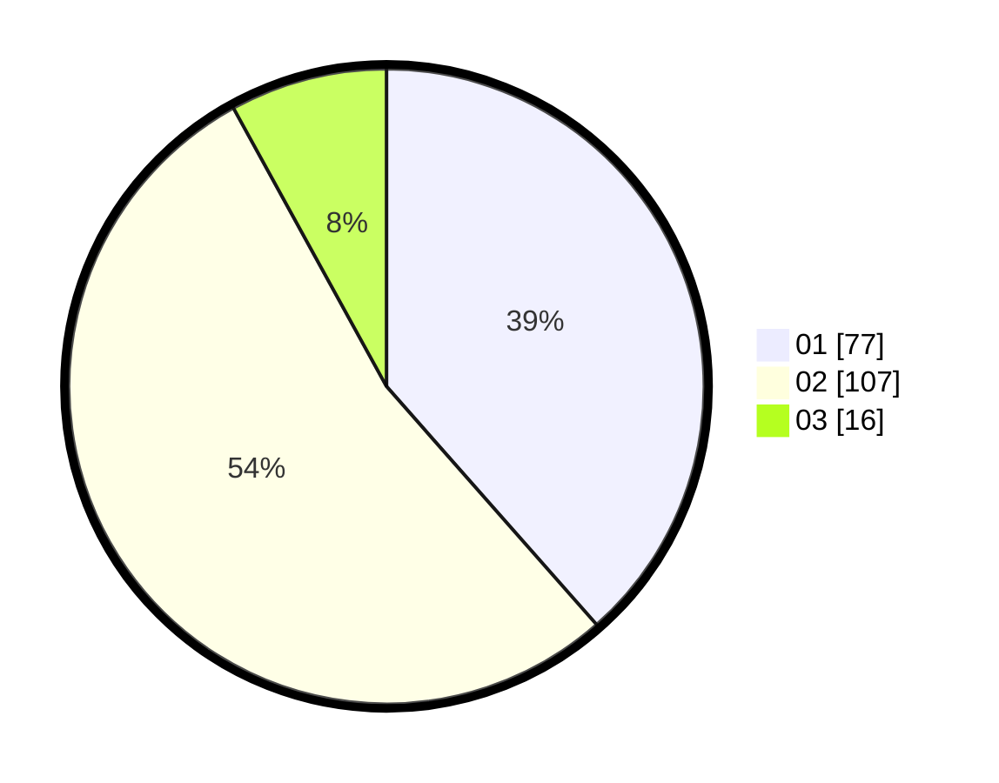

# Hasil

Hasil perolehan suara paslon dapat dilihat pada file paslon-01.txt, paslon-02.txt, dan paslon-03.txt.

Jika tidak ada, artinya data tersebut belum ada pada SIREKAP.

## Perolehan Suara

 * Paslon 01: **77**.
 * Paslon 02: **107**.
 * Paslon 03: **16**.

## Foto C Plano

https://sirekap-obj-formc.kpu.go.id/abd2/pemilu/ppwp/31/73/01/10/02/3173011002103-20240214-202042--9b4b639e-c6c5-47bf-bd08-27eb5555c792.jpg

https://sirekap-obj-formc.kpu.go.id/abd2/pemilu/ppwp/31/73/01/10/02/3173011002103-20240214-202331--263c8d1a-69bd-485d-becd-b731f49c4a55.jpg

https://sirekap-obj-formc.kpu.go.id/abd2/pemilu/ppwp/31/73/01/10/02/3173011002103-20240214-202204--7663ef6b-78fb-46a7-8b70-0079b384d00f.jpg
