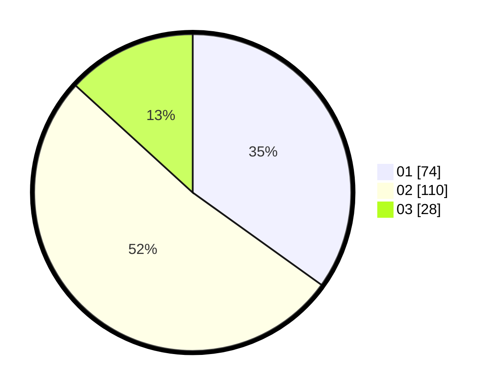

# Hasil

Hasil perolehan suara paslon dapat dilihat pada file paslon-01.txt, paslon-02.txt, dan paslon-03.txt.

Jika tidak ada, artinya data tersebut belum ada pada SIREKAP.

## Perolehan Suara

 * Paslon 01: **74**.
 * Paslon 02: **110**.
 * Paslon 03: **28**.

## Foto C Plano

https://sirekap-obj-formc.kpu.go.id/0498/pemilu/ppwp/31/73/01/10/02/3173011002104-20240214-214848--53e07829-c859-480b-9bc4-e629bb11c05c.jpg

https://sirekap-obj-formc.kpu.go.id/0498/pemilu/ppwp/31/73/01/10/02/3173011002104-20240214-215110--b2a7fbe8-4018-4701-baaf-3e29d71f3b91.jpg

https://sirekap-obj-formc.kpu.go.id/0498/pemilu/ppwp/31/73/01/10/02/3173011002104-20240214-215622--0848852b-3fd1-4ecd-910c-d99ad04f9011.jpg
