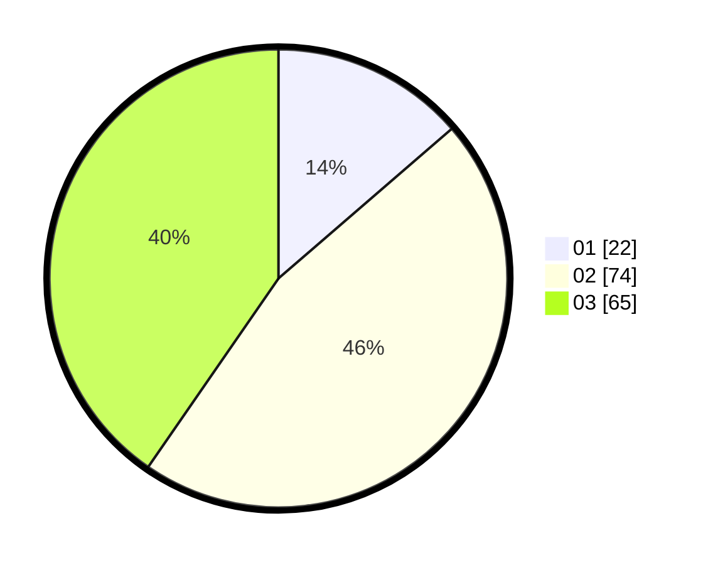

# Hasil

Hasil perolehan suara paslon dapat dilihat pada file paslon-01.txt, paslon-02.txt, dan paslon-03.txt.

Jika tidak ada, artinya data tersebut belum ada pada SIREKAP.

## Perolehan Suara

 * Paslon 01: **22**.
 * Paslon 02: **74**.
 * Paslon 03: **65**.

## Foto C Plano

https://sirekap-obj-formc.kpu.go.id/1718/pemilu/ppwp/31/73/01/10/02/3173011002111-20240215-152648--c5130577-4b3f-41bd-9db9-1c6c95016822.jpg

https://sirekap-obj-formc.kpu.go.id/1718/pemilu/ppwp/31/73/01/10/02/3173011002111-20240215-160401--e77ae10b-bd7f-4023-ab7e-60958c15cd85.jpg

https://sirekap-obj-formc.kpu.go.id/1718/pemilu/ppwp/31/73/01/10/02/3173011002111-20240215-153601--202f4adf-79a2-463e-9c1b-cd4de3d03c7d.jpg

## DATA PEMILIH TETAP

Jumlah pemilih dalam DPT: **243**.
 * L: **119**.
 * P: **124**.

## DATA PENGGUNA HAK PILIH

Jumlah pengguna hak pilih dalam DPT: **138**.
 * L: **67**.
 * P: **71**.

Jumlah pengguna hak pilih dalam DPTb: **16**.
 * L: **7**.
 * P: **9**.

Jumlah pengguna hak pilih dalam DPK: **10**.
 * L: **3**.
 * P: **7**.

Jumlah pengguna hak pilih: **164**.
 * L: **77**.
 * P: **87**.

## JUMLAH SUARA SAH DAN TIDAK SAH

JUMLAH SELURUH SUARA SAH: **161**.

JUMLAH SUARA TIDAK SAH: **3**.

JUMLAH SELURUH SUARA SAH DAN SUARA TIDAK SAH: **164**.
