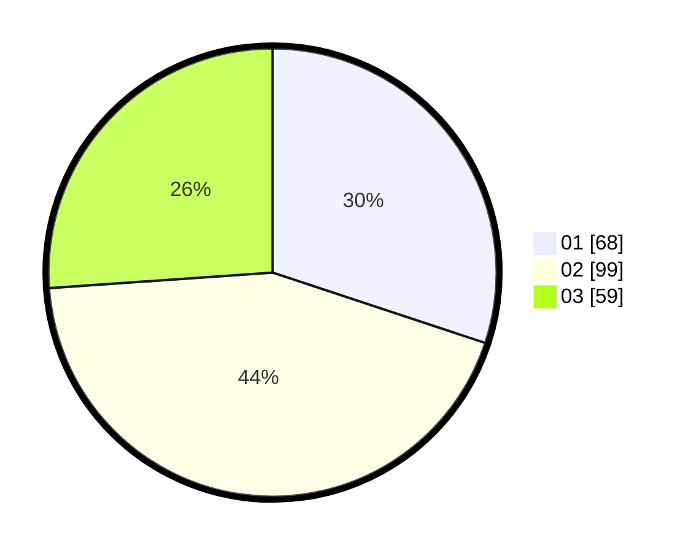

# Hasil

Hasil perolehan suara paslon dapat dilihat pada file paslon-01.txt, paslon-02.txt, dan paslon-03.txt.

Jika tidak ada, artinya data tersebut belum ada pada SIREKAP.

## Perolehan Suara

 * Paslon 01: **68**.
 * Paslon 02: **99**.
 * Paslon 03: **59**.

## Foto C Plano

https://sirekap-obj-formc.kpu.go.id/e331/pemilu/ppwp/31/73/01/10/02/3173011002113-20240214-190604--d7d13dfd-9dba-4c16-aeb0-0882656a375f.jpg

https://sirekap-obj-formc.kpu.go.id/e331/pemilu/ppwp/31/73/01/10/02/3173011002113-20240214-190651--15d3cc03-73be-4f97-addd-ba5cfbfb426e.jpg

https://sirekap-obj-formc.kpu.go.id/e331/pemilu/ppwp/31/73/01/10/02/3173011002113-20240214-190730--3f5ee331-c1f0-4319-9765-5dff3207435c.jpg

## DATA PEMILIH TETAP

Jumlah pemilih dalam DPT: **291**.
 * L: **137**.
 * P: **154**.

## DATA PENGGUNA HAK PILIH

Jumlah pengguna hak pilih dalam DPT: **212**.
 * L: **100**.
 * P: **112**.

Jumlah pengguna hak pilih dalam DPTb: **16**.
 * L: **7**.
 * P: **9**.

Jumlah pengguna hak pilih dalam DPK: **4**.
 * L: **2**.
 * P: **2**.

Jumlah pengguna hak pilih: **232**.
 * L: **109**.
 * P: **123**.

## JUMLAH SUARA SAH DAN TIDAK SAH

JUMLAH SELURUH SUARA SAH: **226**.

JUMLAH SUARA TIDAK SAH: **0**.

JUMLAH SELURUH SUARA SAH DAN SUARA TIDAK SAH: **232**.
