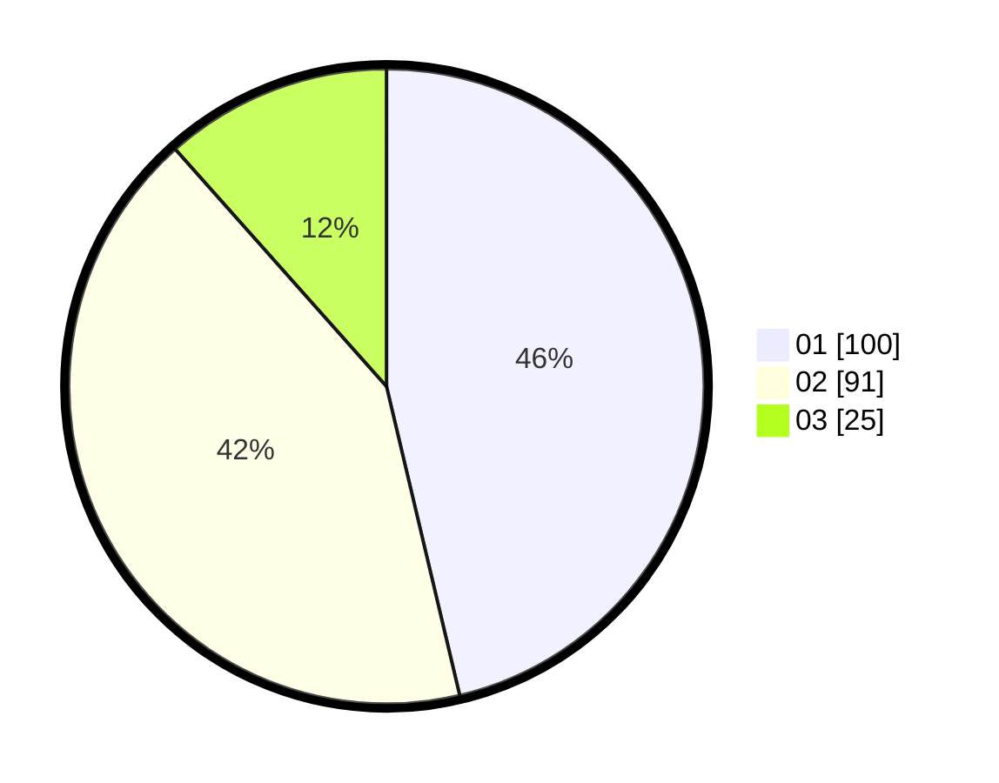

# Hasil

Hasil perolehan suara paslon dapat dilihat pada file paslon-01.txt, paslon-02.txt, dan paslon-03.txt.

Jika tidak ada, artinya data tersebut belum ada pada SIREKAP.

## Perolehan Suara

 * Paslon 01: **100**.
 * Paslon 02: **91**.
 * Paslon 03: **25**.

## Foto C Plano

https://sirekap-obj-formc.kpu.go.id/7c36/pemilu/ppwp/31/73/01/10/02/3173011002114-20240216-150910--e980e619-f46d-4870-b94d-c0fac6207aca.jpg

https://sirekap-obj-formc.kpu.go.id/7c36/pemilu/ppwp/31/73/01/10/02/3173011002114-20240216-150911--ef3e3185-9400-4f61-81a0-a81b5ed3d9bc.jpg

https://sirekap-obj-formc.kpu.go.id/7c36/pemilu/ppwp/31/73/01/10/02/3173011002114-20240216-150911--47909cfe-f493-4750-bd3f-284cd6dfec7a.jpg

## DATA PEMILIH TETAP

Jumlah pemilih dalam DPT: **278**.
 * L: **137**.
 * P: **141**.

## DATA PENGGUNA HAK PILIH

Jumlah pengguna hak pilih dalam DPT: **212**.
 * L: **100**.
 * P: **112**.

Jumlah pengguna hak pilih dalam DPTb: **3**.
 * L: **1**.
 * P: **2**.

Jumlah pengguna hak pilih dalam DPK: **1**.
 * L: **0**.
 * P: **1**.

Jumlah pengguna hak pilih: **216**.
 * L: **101**.
 * P: **115**.

## JUMLAH SUARA SAH DAN TIDAK SAH

JUMLAH SELURUH SUARA SAH: **216**.

JUMLAH SUARA TIDAK SAH: **0**.

JUMLAH SELURUH SUARA SAH DAN SUARA TIDAK SAH: **216**.
