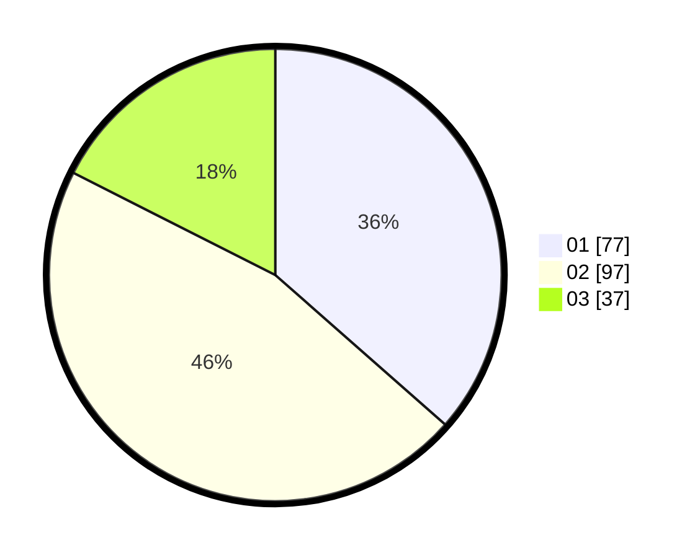

# Hasil

Hasil perolehan suara paslon dapat dilihat pada file paslon-01.txt, paslon-02.txt, dan paslon-03.txt.

Jika tidak ada, artinya data tersebut belum ada pada SIREKAP.

## Perolehan Suara

 * Paslon 01: **77**.
 * Paslon 02: **97**.
 * Paslon 03: **37**.

## Foto C Plano

https://sirekap-obj-formc.kpu.go.id/1aa7/pemilu/ppwp/31/73/01/10/02/3173011002115-20240214-235218--bcf997db-c236-4243-96d1-8f8b1fcfdda7.jpg

https://sirekap-obj-formc.kpu.go.id/1aa7/pemilu/ppwp/31/73/01/10/02/3173011002115-20240214-235312--ef981c4e-4edd-4675-9a40-5cb8cd682a8b.jpg

https://sirekap-obj-formc.kpu.go.id/1aa7/pemilu/ppwp/31/73/01/10/02/3173011002115-20240216-145506--35df0482-24d8-47f4-b0a8-4689d611baaa.jpg

## DATA PEMILIH TETAP

Jumlah pemilih dalam DPT: **270**.
 * L: **136**.
 * P: **134**.

## DATA PENGGUNA HAK PILIH

Jumlah pengguna hak pilih dalam DPT: **216**.
 * L: **101**.
 * P: **115**.

Jumlah pengguna hak pilih dalam DPTb: **1**.
 * L: **1**.
 * P: **0**.

Jumlah pengguna hak pilih dalam DPK: **3**.
 * L: **2**.
 * P: **1**.

Jumlah pengguna hak pilih: **220**.
 * L: **104**.
 * P: **116**.

## JUMLAH SUARA SAH DAN TIDAK SAH

JUMLAH SELURUH SUARA SAH: **211**.

JUMLAH SUARA TIDAK SAH: **9**.

JUMLAH SELURUH SUARA SAH DAN SUARA TIDAK SAH: **220**.
