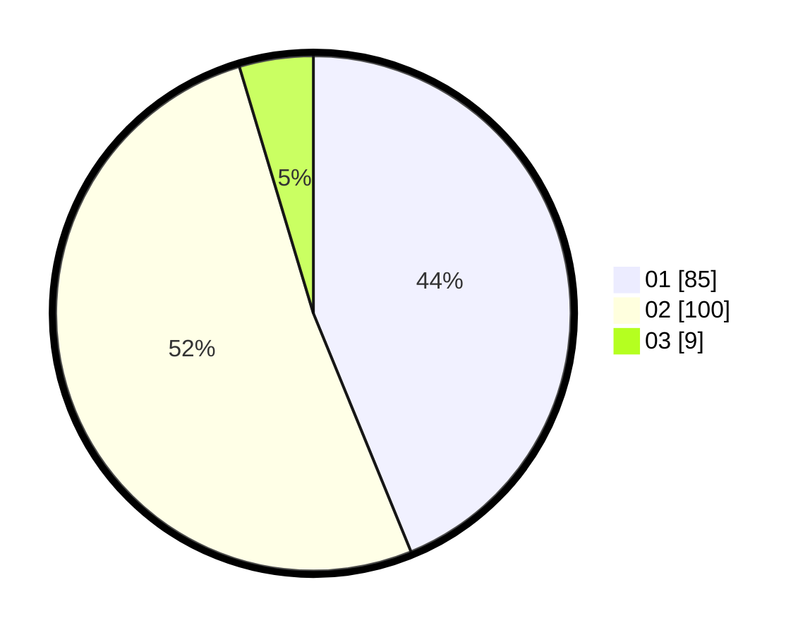

# Hasil

Hasil perolehan suara paslon dapat dilihat pada file paslon-01.txt, paslon-02.txt, dan paslon-03.txt.

Jika tidak ada, artinya data tersebut belum ada pada SIREKAP.

## Perolehan Suara

 * Paslon 01: **85**.
 * Paslon 02: **100**.
 * Paslon 03: **9**.

## Foto C Plano

https://sirekap-obj-formc.kpu.go.id/87db/pemilu/ppwp/31/73/01/10/02/3173011002116-20240214-185658--d205c602-77ab-42ed-97bf-51f5d1af83d1.jpg

https://sirekap-obj-formc.kpu.go.id/87db/pemilu/ppwp/31/73/01/10/02/3173011002116-20240214-185754--410e994f-113e-410d-8dd3-944a1d77c462.jpg

https://sirekap-obj-formc.kpu.go.id/87db/pemilu/ppwp/31/73/01/10/02/3173011002116-20240214-185919--46e90954-3fe9-4bad-907f-f7378dac7630.jpg
