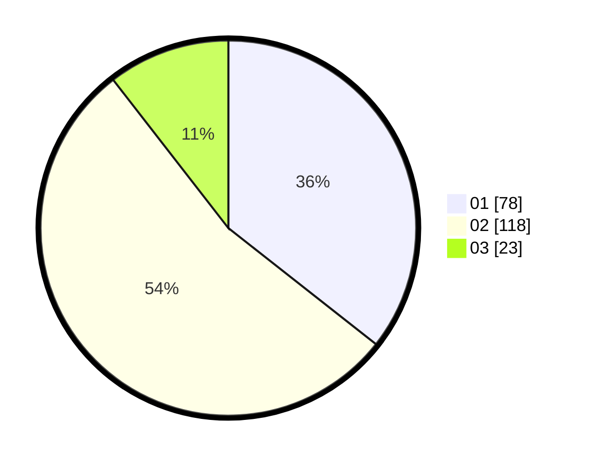

# Hasil

Hasil perolehan suara paslon dapat dilihat pada file paslon-01.txt, paslon-02.txt, dan paslon-03.txt.

Jika tidak ada, artinya data tersebut belum ada pada SIREKAP.

## Perolehan Suara

 * Paslon 01: **78**.
 * Paslon 02: **118**.
 * Paslon 03: **23**.

## Foto C Plano

https://sirekap-obj-formc.kpu.go.id/647c/pemilu/ppwp/31/73/01/10/02/3173011002119-20240216-140700--f1203853-58b2-47ad-93fd-56fb91b7116a.jpg

https://sirekap-obj-formc.kpu.go.id/647c/pemilu/ppwp/31/73/01/10/02/3173011002119-20240216-140702--ed17d3e2-745a-479f-80e0-bc85d62c5fb6.jpg

https://sirekap-obj-formc.kpu.go.id/647c/pemilu/ppwp/31/73/01/10/02/3173011002119-20240216-140701--c6f5a34b-cbc0-46c4-bbe2-bdeaf4afe5be.jpg

## DATA PEMILIH TETAP

Jumlah pemilih dalam DPT: **275**.
 * L: **137**.
 * P: **138**.

## DATA PENGGUNA HAK PILIH

Jumlah pengguna hak pilih dalam DPT: **218**.
 * L: **101**.
 * P: **117**.

Jumlah pengguna hak pilih dalam DPTb: **5**.
 * L: **3**.
 * P: **2**.

Jumlah pengguna hak pilih dalam DPK: **3**.
 * L: **2**.
 * P: **1**.

Jumlah pengguna hak pilih: **226**.
 * L: **106**.
 * P: **120**.

## JUMLAH SUARA SAH DAN TIDAK SAH

JUMLAH SELURUH SUARA SAH: **219**.

JUMLAH SUARA TIDAK SAH: **7**.

JUMLAH SELURUH SUARA SAH DAN SUARA TIDAK SAH: **226**.
