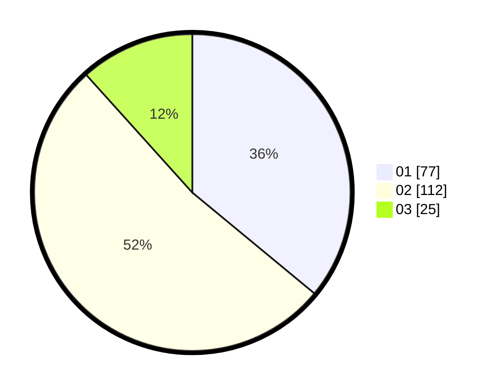

# Hasil

Hasil perolehan suara paslon dapat dilihat pada file paslon-01.txt, paslon-02.txt, dan paslon-03.txt.

Jika tidak ada, artinya data tersebut belum ada pada SIREKAP.

## Perolehan Suara

 * Paslon 01: **77**.
 * Paslon 02: **112**.
 * Paslon 03: **25**.

## Foto C Plano

https://sirekap-obj-formc.kpu.go.id/14b3/pemilu/ppwp/31/73/01/10/02/3173011002122-20240216-052626--217423cc-4a8d-43cd-8051-cf4c3e28c53f.jpg

https://sirekap-obj-formc.kpu.go.id/14b3/pemilu/ppwp/31/73/01/10/02/3173011002122-20240216-052636--ff0cdbe6-5186-4aa2-8348-1e2eee70a347.jpg

https://sirekap-obj-formc.kpu.go.id/14b3/pemilu/ppwp/31/73/01/10/02/3173011002122-20240216-052630--7ba9c538-2101-4137-a3ac-bb7e95a5dc70.jpg

## DATA PEMILIH TETAP

Jumlah pemilih dalam DPT: **270**.
 * L: **132**.
 * P: **138**.

## DATA PENGGUNA HAK PILIH

Jumlah pengguna hak pilih dalam DPT: **218**.
 * L: **114**.
 * P: **104**.

Jumlah pengguna hak pilih dalam DPTb: **0**.
 * L: **0**.
 * P: **0**.

Jumlah pengguna hak pilih dalam DPK: **1**.
 * L: **0**.
 * P: **1**.

Jumlah pengguna hak pilih: **219**.
 * L: **114**.
 * P: **105**.

## JUMLAH SUARA SAH DAN TIDAK SAH

JUMLAH SELURUH SUARA SAH: **214**.

JUMLAH SUARA TIDAK SAH: **5**.

JUMLAH SELURUH SUARA SAH DAN SUARA TIDAK SAH: **219**.
