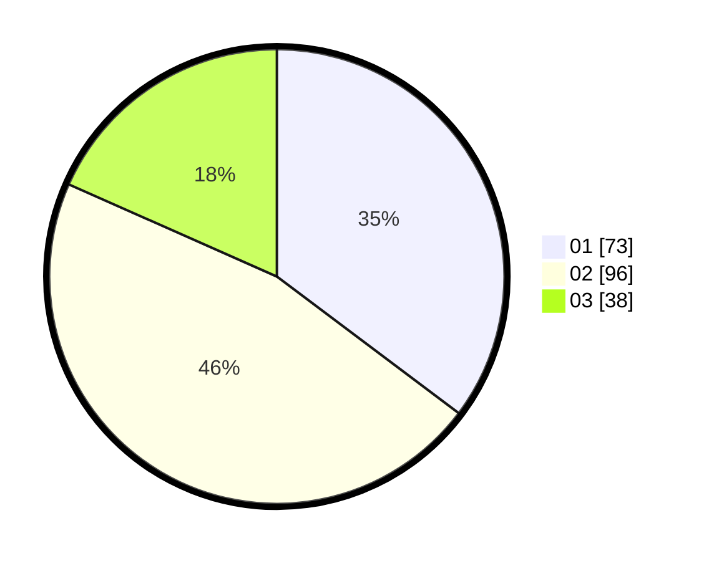

# Hasil

Hasil perolehan suara paslon dapat dilihat pada file paslon-01.txt, paslon-02.txt, dan paslon-03.txt.

Jika tidak ada, artinya data tersebut belum ada pada SIREKAP.

## Perolehan Suara

 * Paslon 01: **73**.
 * Paslon 02: **96**.
 * Paslon 03: **38**.

## Foto C Plano

https://sirekap-obj-formc.kpu.go.id/5730/pemilu/ppwp/31/73/01/10/02/3173011002128-20240214-200412--2a518d76-d6ac-4dc1-b87c-d341027fc098.jpg

https://sirekap-obj-formc.kpu.go.id/5730/pemilu/ppwp/31/73/01/10/02/3173011002128-20240216-082631--231a586b-d162-4cad-b1f1-0c4a9fed528a.jpg

https://sirekap-obj-formc.kpu.go.id/5730/pemilu/ppwp/31/73/01/10/02/3173011002128-20240216-082630--79dc4b0e-d232-4c91-a2d0-6fee39c2f262.jpg

## DATA PEMILIH TETAP

Jumlah pemilih dalam DPT: **203**.
 * L: **101**.
 * P: **102**.

## DATA PENGGUNA HAK PILIH

Jumlah pengguna hak pilih dalam DPT: **203**.
 * L: **101**.
 * P: **102**.

Jumlah pengguna hak pilih dalam DPTb: **2**.
 * L: **1**.
 * P: **1**.

Jumlah pengguna hak pilih dalam DPK: **2**.
 * L: **1**.
 * P: **1**.

Jumlah pengguna hak pilih: **207**.
 * L: **103**.
 * P: **104**.

## JUMLAH SUARA SAH DAN TIDAK SAH

JUMLAH SELURUH SUARA SAH: **207**.

JUMLAH SUARA TIDAK SAH: **0**.

JUMLAH SELURUH SUARA SAH DAN SUARA TIDAK SAH: **207**.
