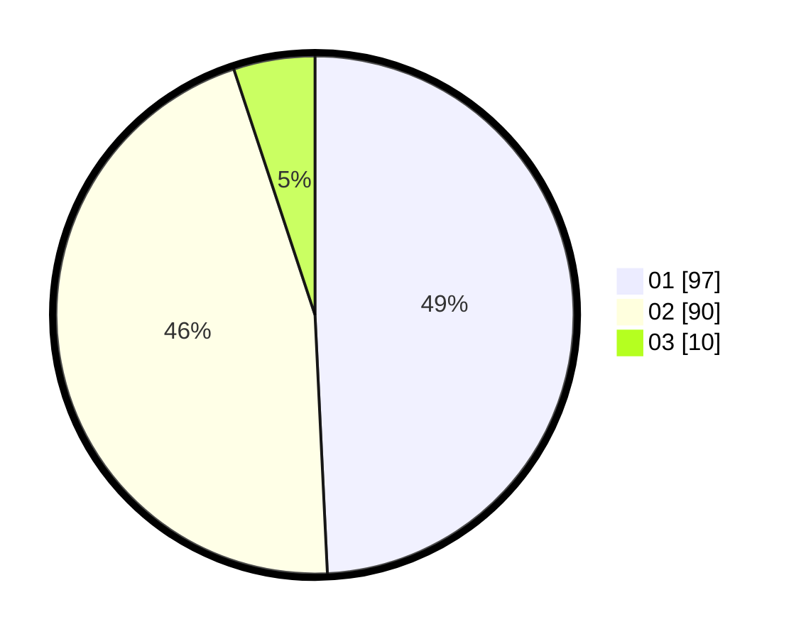

# Hasil

Hasil perolehan suara paslon dapat dilihat pada file paslon-01.txt, paslon-02.txt, dan paslon-03.txt.

Jika tidak ada, artinya data tersebut belum ada pada SIREKAP.

## Perolehan Suara

 * Paslon 01: **97**.
 * Paslon 02: **90**.
 * Paslon 03: **10**.

## Foto C Plano

https://sirekap-obj-formc.kpu.go.id/0106/pemilu/ppwp/31/73/01/10/02/3173011002133-20240215-004758--1f73b340-f23f-4ea2-8de8-f26a6c174870.jpg

https://sirekap-obj-formc.kpu.go.id/0106/pemilu/ppwp/31/73/01/10/02/3173011002133-20240214-192055--643188eb-6faf-4647-95c9-6b50842c468e.jpg

https://sirekap-obj-formc.kpu.go.id/0106/pemilu/ppwp/31/73/01/10/02/3173011002133-20240214-192248--5db9af47-c471-4703-85ec-88e44d932766.jpg
