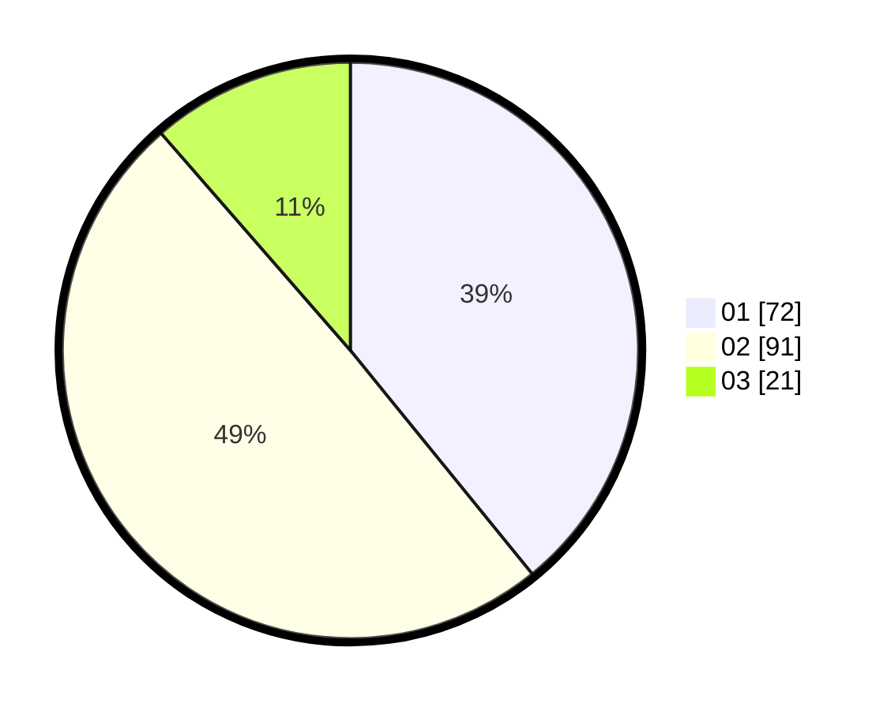

# Hasil

Hasil perolehan suara paslon dapat dilihat pada file paslon-01.txt, paslon-02.txt, dan paslon-03.txt.

Jika tidak ada, artinya data tersebut belum ada pada SIREKAP.

## Perolehan Suara

 * Paslon 01: **72**.
 * Paslon 02: **91**.
 * Paslon 03: **21**.

## Foto C Plano

https://sirekap-obj-formc.kpu.go.id/00d8/pemilu/ppwp/31/73/01/10/02/3173011002135-20240216-145200--42e3eb46-e4cf-4224-8fde-29ddc2a6f612.jpg

https://sirekap-obj-formc.kpu.go.id/00d8/pemilu/ppwp/31/73/01/10/02/3173011002135-20240216-145201--c9c4af6f-c612-43cd-b6a3-d0025b92d90a.jpg

https://sirekap-obj-formc.kpu.go.id/00d8/pemilu/ppwp/31/73/01/10/02/3173011002135-20240216-145201--1cec19e3-b528-450a-bad8-2d69a7089888.jpg

## DATA PEMILIH TETAP

Jumlah pemilih dalam DPT: **277**.
 * L: **133**.
 * P: **144**.

## DATA PENGGUNA HAK PILIH

Jumlah pengguna hak pilih dalam DPT: **184**.
 * L: **86**.
 * P: **98**.

Jumlah pengguna hak pilih dalam DPTb: **1**.
 * L: **0**.
 * P: **1**.

Jumlah pengguna hak pilih dalam DPK: **2**.
 * L: **1**.
 * P: **1**.

Jumlah pengguna hak pilih: **187**.
 * L: **87**.
 * P: **100**.

## JUMLAH SUARA SAH DAN TIDAK SAH

JUMLAH SELURUH SUARA SAH: **184**.

JUMLAH SUARA TIDAK SAH: **3**.

JUMLAH SELURUH SUARA SAH DAN SUARA TIDAK SAH: **187**.
