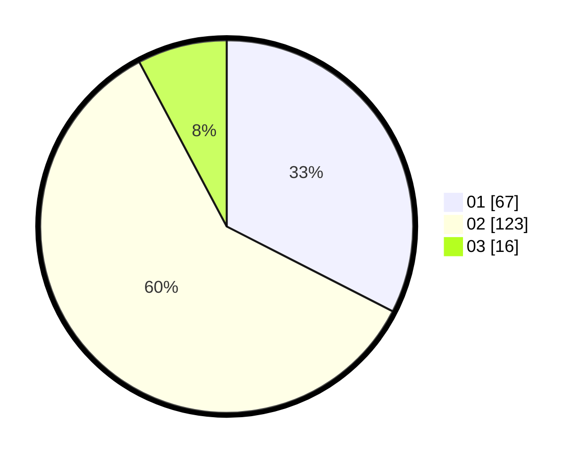

# Hasil

Hasil perolehan suara paslon dapat dilihat pada file paslon-01.txt, paslon-02.txt, dan paslon-03.txt.

Jika tidak ada, artinya data tersebut belum ada pada SIREKAP.

## Perolehan Suara

 * Paslon 01: **67**.
 * Paslon 02: **123**.
 * Paslon 03: **16**.

## Foto C Plano

https://sirekap-obj-formc.kpu.go.id/288f/pemilu/ppwp/31/73/01/10/02/3173011002137-20240215-213742--b8890fcd-acce-45cf-95b8-d40714240bd6.jpg

https://sirekap-obj-formc.kpu.go.id/288f/pemilu/ppwp/31/73/01/10/02/3173011002137-20240215-213744--7088ae48-7090-492b-b71b-f4b9b28859fb.jpg

https://sirekap-obj-formc.kpu.go.id/288f/pemilu/ppwp/31/73/01/10/02/3173011002137-20240215-213743--81657e36-b9b3-4baa-8c64-65b8c8a8ed36.jpg

## DATA PEMILIH TETAP

Jumlah pemilih dalam DPT: **270**.
 * L: **135**.
 * P: **135**.

## DATA PENGGUNA HAK PILIH

Jumlah pengguna hak pilih dalam DPT: **206**.
 * L: **95**.
 * P: **111**.

Jumlah pengguna hak pilih dalam DPTb: **0**.
 * L: **0**.
 * P: **0**.

Jumlah pengguna hak pilih dalam DPK: **0**.
 * L: **0**.
 * P: **0**.

Jumlah pengguna hak pilih: **206**.
 * L: **95**.
 * P: **111**.

## JUMLAH SUARA SAH DAN TIDAK SAH

JUMLAH SELURUH SUARA SAH: **206**.

JUMLAH SUARA TIDAK SAH: **0**.

JUMLAH SELURUH SUARA SAH DAN SUARA TIDAK SAH: **206**.
