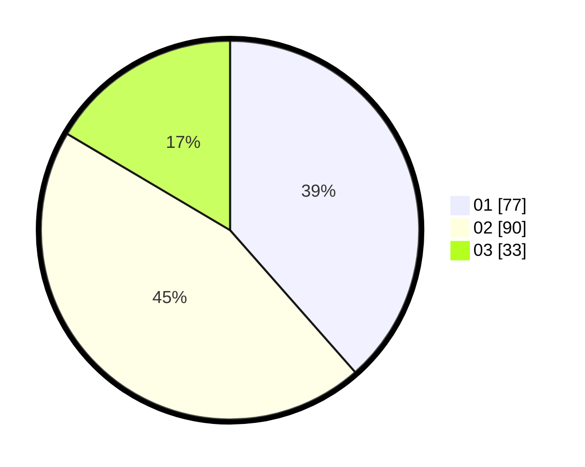

# Hasil

Hasil perolehan suara paslon dapat dilihat pada file paslon-01.txt, paslon-02.txt, dan paslon-03.txt.

Jika tidak ada, artinya data tersebut belum ada pada SIREKAP.

## Perolehan Suara

 * Paslon 01: **77**.
 * Paslon 02: **90**.
 * Paslon 03: **33**.

## Foto C Plano

https://sirekap-obj-formc.kpu.go.id/1396/pemilu/ppwp/31/73/01/10/02/3173011002146-20240214-203555--045d86b0-5ca5-4ce9-b3fa-869f4ab2c312.jpg

https://sirekap-obj-formc.kpu.go.id/1396/pemilu/ppwp/31/73/01/10/02/3173011002146-20240214-203815--32eb105a-1527-4a14-ac2d-c7ef74bc1c42.jpg

https://sirekap-obj-formc.kpu.go.id/1396/pemilu/ppwp/31/73/01/10/02/3173011002146-20240214-204117--52c50c6c-4b9b-4eb9-9c82-6427cab4f5df.jpg

## DATA PEMILIH TETAP

Jumlah pemilih dalam DPT: **201**.
 * L: **105**.
 * P: **96**.

## DATA PENGGUNA HAK PILIH

Jumlah pengguna hak pilih dalam DPT: **201**.
 * L: **105**.
 * P: **896**.

Jumlah pengguna hak pilih dalam DPTb: **0**.
 * L: **0**.
 * P: **0**.

Jumlah pengguna hak pilih dalam DPK: **0**.
 * L: **0**.
 * P: **0**.

Jumlah pengguna hak pilih: **201**.
 * L: **105**.
 * P: **96**.

## JUMLAH SUARA SAH DAN TIDAK SAH

JUMLAH SELURUH SUARA SAH: **200**.

JUMLAH SUARA TIDAK SAH: **1**.

JUMLAH SELURUH SUARA SAH DAN SUARA TIDAK SAH: **201**.
