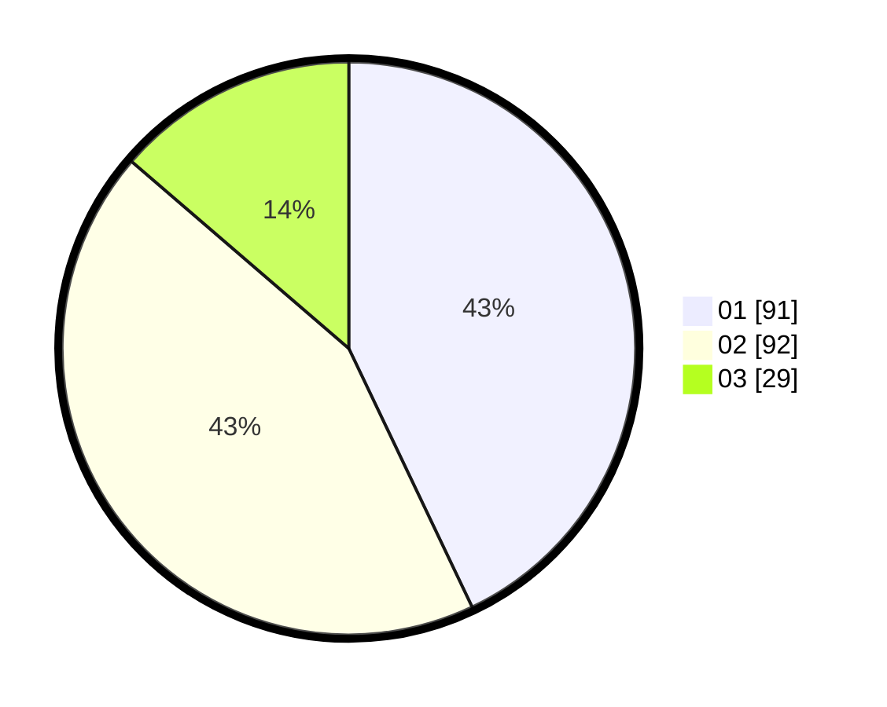

# Hasil

Hasil perolehan suara paslon dapat dilihat pada file paslon-01.txt, paslon-02.txt, dan paslon-03.txt.

Jika tidak ada, artinya data tersebut belum ada pada SIREKAP.

## Perolehan Suara

 * Paslon 01: **91**.
 * Paslon 02: **92**.
 * Paslon 03: **29**.

## Foto C Plano

https://sirekap-obj-formc.kpu.go.id/63d3/pemilu/ppwp/31/73/01/10/02/3173011002158-20240216-141126--26fb7a43-78ef-46ef-a8b4-fa26fd3501cc.jpg

https://sirekap-obj-formc.kpu.go.id/63d3/pemilu/ppwp/31/73/01/10/02/3173011002158-20240216-141127--3445cdd9-a4df-45e2-a7f7-6d4278aea612.jpg

https://sirekap-obj-formc.kpu.go.id/63d3/pemilu/ppwp/31/73/01/10/02/3173011002158-20240216-141127--1e4c752a-9a5d-4ddc-a466-e8b9a9955307.jpg

## DATA PEMILIH TETAP

Jumlah pemilih dalam DPT: **269**.
 * L: **135**.
 * P: **134**.

## DATA PENGGUNA HAK PILIH

Jumlah pengguna hak pilih dalam DPT: **213**.
 * L: **107**.
 * P: **106**.

Jumlah pengguna hak pilih dalam DPTb: **0**.
 * L: **0**.
 * P: **0**.

Jumlah pengguna hak pilih dalam DPK: **4**.
 * L: **2**.
 * P: **2**.

Jumlah pengguna hak pilih: **217**.
 * L: **109**.
 * P: **108**.

## JUMLAH SUARA SAH DAN TIDAK SAH

JUMLAH SELURUH SUARA SAH: **212**.

JUMLAH SUARA TIDAK SAH: **5**.

JUMLAH SELURUH SUARA SAH DAN SUARA TIDAK SAH: **217**.
