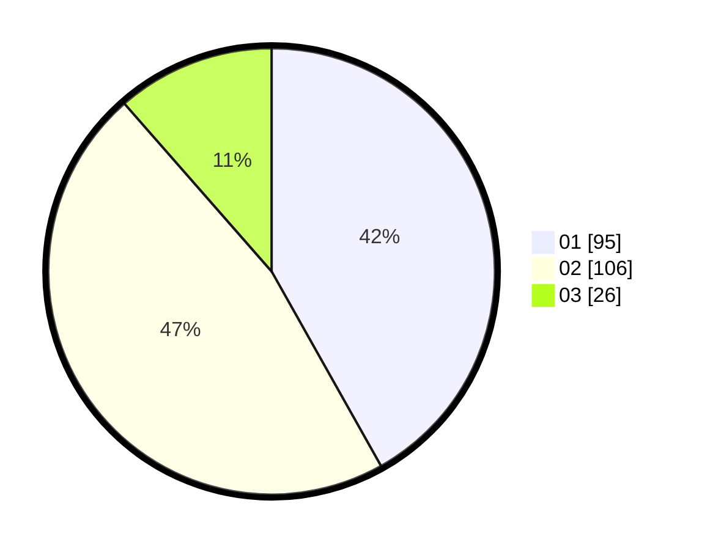

# Hasil

Hasil perolehan suara paslon dapat dilihat pada file paslon-01.txt, paslon-02.txt, dan paslon-03.txt.

Jika tidak ada, artinya data tersebut belum ada pada SIREKAP.

## Perolehan Suara

 * Paslon 01: **95**.
 * Paslon 02: **106**.
 * Paslon 03: **26**.

## Foto C Plano

https://sirekap-obj-formc.kpu.go.id/5f75/pemilu/ppwp/31/73/01/10/02/3173011002160-20240215-122139--d87f5949-1d3f-4197-be65-0edb29327b17.jpg

https://sirekap-obj-formc.kpu.go.id/5f75/pemilu/ppwp/31/73/01/10/02/3173011002160-20240215-122318--28508bf2-e48e-4d34-a852-3210fb4ac8c7.jpg

https://sirekap-obj-formc.kpu.go.id/5f75/pemilu/ppwp/31/73/01/10/02/3173011002160-20240215-122445--6ee8f648-ba3e-4d2e-8625-bab2c5855f3a.jpg
