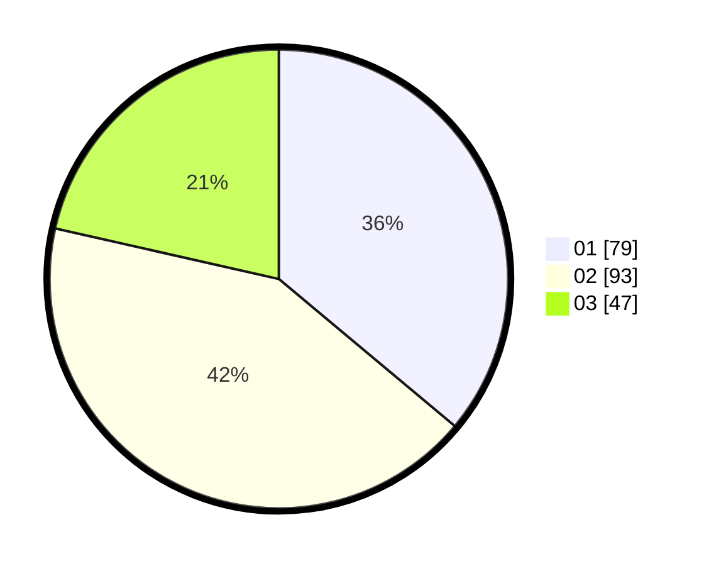

# Hasil

Hasil perolehan suara paslon dapat dilihat pada file paslon-01.txt, paslon-02.txt, dan paslon-03.txt.

Jika tidak ada, artinya data tersebut belum ada pada SIREKAP.

## Perolehan Suara

 * Paslon 01: **79**.
 * Paslon 02: **93**.
 * Paslon 03: **47**.

## Foto C Plano

https://sirekap-obj-formc.kpu.go.id/5379/pemilu/ppwp/31/73/01/10/02/3173011002165-20240214-155818--eb215474-a1a1-4c5a-abaa-33d5a21cc13a.jpg

https://sirekap-obj-formc.kpu.go.id/5379/pemilu/ppwp/31/73/01/10/02/3173011002165-20240214-185928--8cc0fc1f-d5d0-4b6e-828f-e8ec620eb38b.jpg

https://sirekap-obj-formc.kpu.go.id/5379/pemilu/ppwp/31/73/01/10/02/3173011002165-20240214-183951--243f3a8f-42c7-4e84-a690-90a0f60d84c6.jpg

## DATA PEMILIH TETAP

Jumlah pemilih dalam DPT: **272**.
 * L: **130**.
 * P: **142**.

## DATA PENGGUNA HAK PILIH

Jumlah pengguna hak pilih dalam DPT: **217**.
 * L: **100**.
 * P: **117**.

Jumlah pengguna hak pilih dalam DPTb: **4**.
 * L: **2**.
 * P: **2**.

Jumlah pengguna hak pilih dalam DPK: **3**.
 * L: **2**.
 * P: **1**.

Jumlah pengguna hak pilih: **224**.
 * L: **104**.
 * P: **120**.

## JUMLAH SUARA SAH DAN TIDAK SAH

JUMLAH SELURUH SUARA SAH: **219**.

JUMLAH SUARA TIDAK SAH: **5**.

JUMLAH SELURUH SUARA SAH DAN SUARA TIDAK SAH: **224**.
