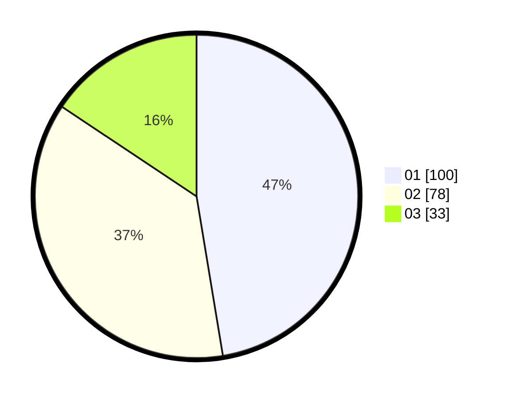

# Hasil

Hasil perolehan suara paslon dapat dilihat pada file paslon-01.txt, paslon-02.txt, dan paslon-03.txt.

Jika tidak ada, artinya data tersebut belum ada pada SIREKAP.

## Perolehan Suara

 * Paslon 01: **100**.
 * Paslon 02: **78**.
 * Paslon 03: **33**.

## Foto C Plano

https://sirekap-obj-formc.kpu.go.id/e545/pemilu/ppwp/31/73/01/10/02/3173011002167-20240216-030534--ad05a610-f5f3-4bac-9141-d0065db2a0d1.jpg

https://sirekap-obj-formc.kpu.go.id/e545/pemilu/ppwp/31/73/01/10/02/3173011002167-20240216-030545--0af6b911-a9dc-4509-ae10-111561d9a14a.jpg

https://sirekap-obj-formc.kpu.go.id/e545/pemilu/ppwp/31/73/01/10/02/3173011002167-20240216-030540--7d833d73-d1d7-42c3-8675-af76fd5b9b5b.jpg

## DATA PEMILIH TETAP

Jumlah pemilih dalam DPT: **206**.
 * L: **96**.
 * P: **110**.

## DATA PENGGUNA HAK PILIH

Jumlah pengguna hak pilih dalam DPT: **206**.
 * L: **96**.
 * P: **110**.

Jumlah pengguna hak pilih dalam DPTb: **6**.
 * L: **3**.
 * P: **3**.

Jumlah pengguna hak pilih dalam DPK: **1**.
 * L: **1**.
 * P: **0**.

Jumlah pengguna hak pilih: **213**.
 * L: **100**.
 * P: **113**.

## JUMLAH SUARA SAH DAN TIDAK SAH

JUMLAH SELURUH SUARA SAH: **211**.

JUMLAH SUARA TIDAK SAH: **2**.

JUMLAH SELURUH SUARA SAH DAN SUARA TIDAK SAH: **213**.
