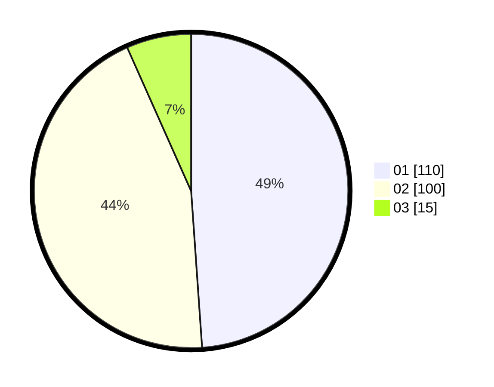

# Hasil

Hasil perolehan suara paslon dapat dilihat pada file paslon-01.txt, paslon-02.txt, dan paslon-03.txt.

Jika tidak ada, artinya data tersebut belum ada pada SIREKAP.

## Perolehan Suara

 * Paslon 01: **110**.
 * Paslon 02: **100**.
 * Paslon 03: **15**.

## Foto C Plano

https://sirekap-obj-formc.kpu.go.id/d6ee/pemilu/ppwp/31/73/01/10/02/3173011002168-20240214-214731--beedeb14-5491-4e0f-a24d-8ef1bdf73672.jpg

https://sirekap-obj-formc.kpu.go.id/d6ee/pemilu/ppwp/31/73/01/10/02/3173011002168-20240214-215437--288008fb-ee5b-4245-9826-5ef88bd70188.jpg

https://sirekap-obj-formc.kpu.go.id/d6ee/pemilu/ppwp/31/73/01/10/02/3173011002168-20240214-215844--843c020b-d3b4-4717-b7c8-1ddd03d1e7e7.jpg
