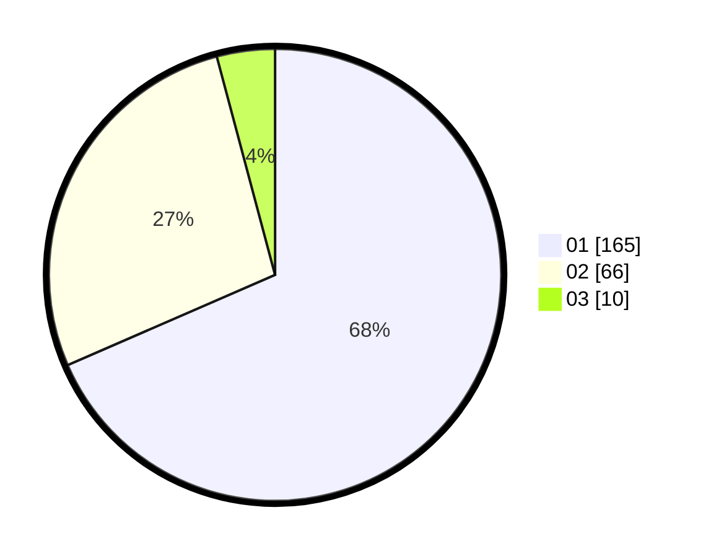

# Hasil

Hasil perolehan suara paslon dapat dilihat pada file paslon-01.txt, paslon-02.txt, dan paslon-03.txt.

Jika tidak ada, artinya data tersebut belum ada pada SIREKAP.

## Perolehan Suara

 * Paslon 01: **165**.
 * Paslon 02: **66**.
 * Paslon 03: **10**.

## Foto C Plano

https://sirekap-obj-formc.kpu.go.id/5ff2/pemilu/ppwp/31/73/01/10/02/3173011002170-20240214-202901--9f917f1e-5446-47cc-ade7-1b206ba26254.jpg

https://sirekap-obj-formc.kpu.go.id/5ff2/pemilu/ppwp/31/73/01/10/02/3173011002170-20240214-202906--9895feb5-0509-4405-94ea-db5fd1a50d6c.jpg

https://sirekap-obj-formc.kpu.go.id/5ff2/pemilu/ppwp/31/73/01/10/02/3173011002170-20240214-202910--6deaa91f-f990-47cf-8f97-2243df821e33.jpg

## DATA PEMILIH TETAP

Jumlah pemilih dalam DPT: **275**.
 * L: **133**.
 * P: **142**.

## DATA PENGGUNA HAK PILIH

Jumlah pengguna hak pilih dalam DPT: **237**.
 * L: **109**.
 * P: **128**.

Jumlah pengguna hak pilih dalam DPTb: **1**.
 * L: **1**.
 * P: **0**.

Jumlah pengguna hak pilih dalam DPK: **3**.
 * L: **2**.
 * P: **1**.

Jumlah pengguna hak pilih: **241**.
 * L: **112**.
 * P: **129**.

## JUMLAH SUARA SAH DAN TIDAK SAH

JUMLAH SELURUH SUARA SAH: **241**.

JUMLAH SUARA TIDAK SAH: **0**.

JUMLAH SELURUH SUARA SAH DAN SUARA TIDAK SAH: **241**.
