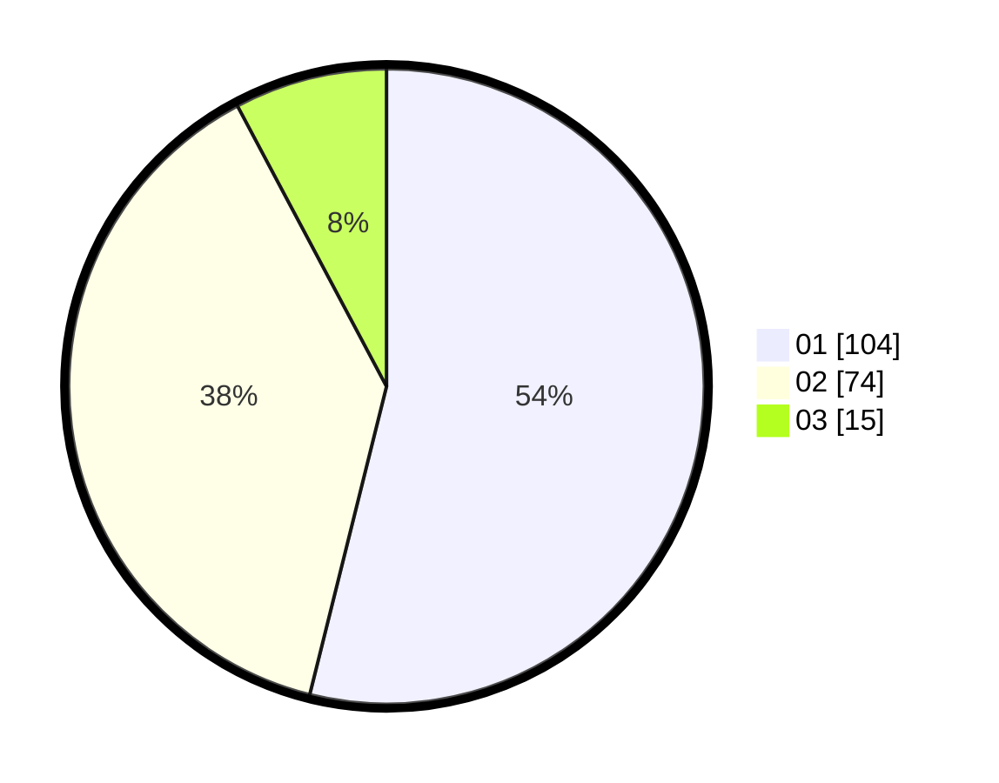

# Hasil

Hasil perolehan suara paslon dapat dilihat pada file paslon-01.txt, paslon-02.txt, dan paslon-03.txt.

Jika tidak ada, artinya data tersebut belum ada pada SIREKAP.

## Perolehan Suara

 * Paslon 01: **104**.
 * Paslon 02: **74**.
 * Paslon 03: **15**.

## Foto C Plano

https://sirekap-obj-formc.kpu.go.id/77c6/pemilu/ppwp/31/73/01/10/02/3173011002171-20240215-231701--646dceed-d6c1-4085-998e-548112ea5d14.jpg

https://sirekap-obj-formc.kpu.go.id/77c6/pemilu/ppwp/31/73/01/10/02/3173011002171-20240215-231705--05d41a27-7d6a-4bfb-96df-56ac812e2d42.jpg

https://sirekap-obj-formc.kpu.go.id/77c6/pemilu/ppwp/31/73/01/10/02/3173011002171-20240215-231703--0c09a57c-5d30-4262-b433-e65dd8538f7e.jpg

## DATA PEMILIH TETAP

Jumlah pemilih dalam DPT: **270**.
 * L: **142**.
 * P: **128**.

## DATA PENGGUNA HAK PILIH

Jumlah pengguna hak pilih dalam DPT: **270**.
 * L: **142**.
 * P: **128**.

Jumlah pengguna hak pilih dalam DPTb: **1**.
 * L: **1**.
 * P: **0**.

Jumlah pengguna hak pilih dalam DPK: **2**.
 * L: **1**.
 * P: **1**.

Jumlah pengguna hak pilih: **273**.
 * L: **144**.
 * P: **129**.

## JUMLAH SUARA SAH DAN TIDAK SAH

JUMLAH SELURUH SUARA SAH: **193**.

JUMLAH SUARA TIDAK SAH: **0**.

JUMLAH SELURUH SUARA SAH DAN SUARA TIDAK SAH: **193**.
