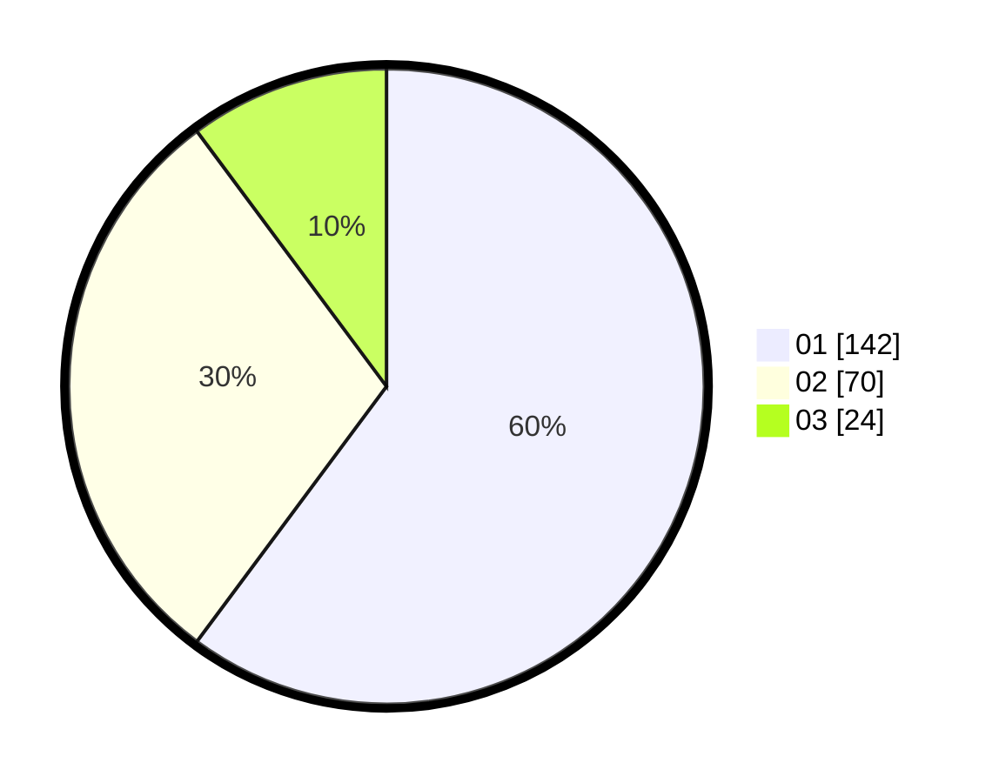

# Hasil

Hasil perolehan suara paslon dapat dilihat pada file paslon-01.txt, paslon-02.txt, dan paslon-03.txt.

Jika tidak ada, artinya data tersebut belum ada pada SIREKAP.

## Perolehan Suara

 * Paslon 01: **142**.
 * Paslon 02: **70**.
 * Paslon 03: **24**.

## Foto C Plano

https://sirekap-obj-formc.kpu.go.id/d6b1/pemilu/ppwp/31/73/01/10/02/3173011002184-20240214-193438--ca1a98c3-ab27-4597-a59d-b9afef0504db.jpg

https://sirekap-obj-formc.kpu.go.id/d6b1/pemilu/ppwp/31/73/01/10/02/3173011002184-20240214-193547--86887ecf-f7ce-491b-8939-43cdf4ebff14.jpg

https://sirekap-obj-formc.kpu.go.id/d6b1/pemilu/ppwp/31/73/01/10/02/3173011002184-20240214-193701--8500851a-9f5c-4dac-8410-e63320f2d372.jpg

## DATA PEMILIH TETAP

Jumlah pemilih dalam DPT: **269**.
 * L: **139**.
 * P: **130**.

## DATA PENGGUNA HAK PILIH

Jumlah pengguna hak pilih dalam DPT: **218**.
 * L: **110**.
 * P: **108**.

Jumlah pengguna hak pilih dalam DPTb: **10**.
 * L: **4**.
 * P: **6**.

Jumlah pengguna hak pilih dalam DPK: **8**.
 * L: **3**.
 * P: **5**.

Jumlah pengguna hak pilih: **236**.
 * L: **717**.
 * P: **119**.

## JUMLAH SUARA SAH DAN TIDAK SAH

JUMLAH SELURUH SUARA SAH: **236**.

JUMLAH SUARA TIDAK SAH: **0**.

JUMLAH SELURUH SUARA SAH DAN SUARA TIDAK SAH: **236**.
