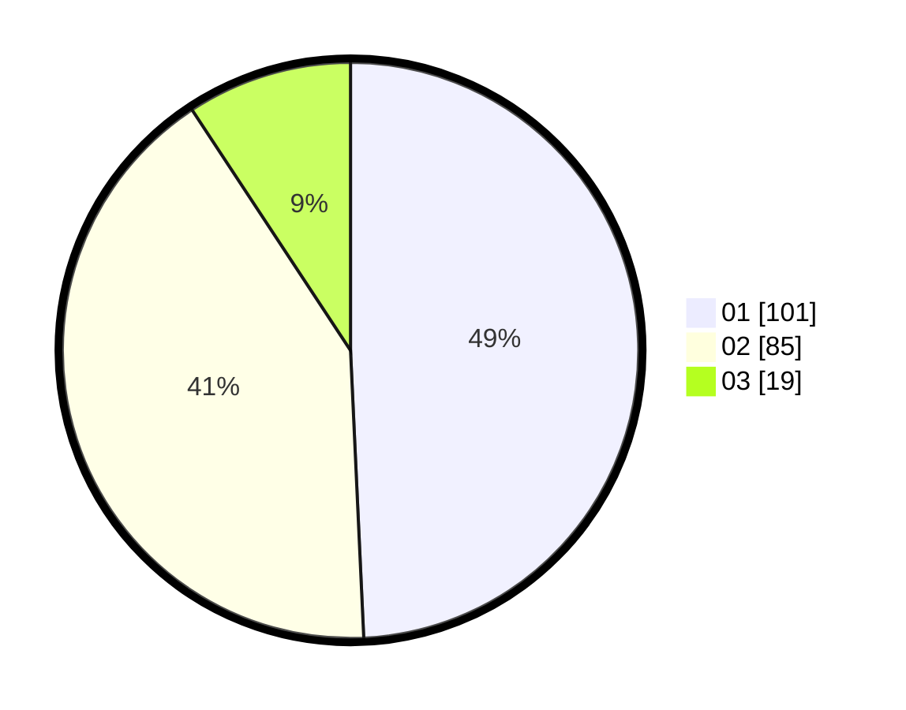

# Hasil

Hasil perolehan suara paslon dapat dilihat pada file paslon-01.txt, paslon-02.txt, dan paslon-03.txt.

Jika tidak ada, artinya data tersebut belum ada pada SIREKAP.

## Perolehan Suara

 * Paslon 01: **101**.
 * Paslon 02: **85**.
 * Paslon 03: **19**.

## Foto C Plano

https://sirekap-obj-formc.kpu.go.id/b559/pemilu/ppwp/31/73/01/10/02/3173011002185-20240214-155129--4e93811f-7095-4c1c-918b-46e391942831.jpg

https://sirekap-obj-formc.kpu.go.id/b559/pemilu/ppwp/31/73/01/10/02/3173011002185-20240214-184448--b00aae82-0ea0-42ae-bb57-577a2686a660.jpg

https://sirekap-obj-formc.kpu.go.id/b559/pemilu/ppwp/31/73/01/10/02/3173011002185-20240216-000116--8843a48d-9b9b-4f91-a4e7-59b5932e65a5.jpg

## DATA PEMILIH TETAP

Jumlah pemilih dalam DPT: **271**.
 * L: **133**.
 * P: **138**.

## DATA PENGGUNA HAK PILIH

Jumlah pengguna hak pilih dalam DPT: **212**.
 * L: **102**.
 * P: **110**.

Jumlah pengguna hak pilih dalam DPTb: **1**.
 * L: **1**.
 * P: **0**.

Jumlah pengguna hak pilih dalam DPK: **6**.
 * L: **4**.
 * P: **2**.

Jumlah pengguna hak pilih: **219**.
 * L: **107**.
 * P: **112**.

## JUMLAH SUARA SAH DAN TIDAK SAH

JUMLAH SELURUH SUARA SAH: **205**.

JUMLAH SUARA TIDAK SAH: **14**.

JUMLAH SELURUH SUARA SAH DAN SUARA TIDAK SAH: **219**.
