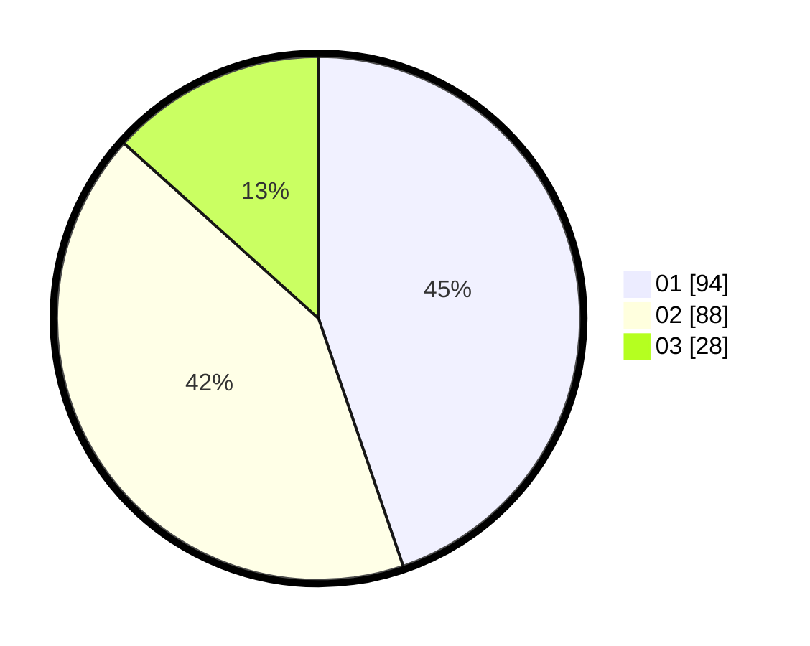

# Hasil

Hasil perolehan suara paslon dapat dilihat pada file paslon-01.txt, paslon-02.txt, dan paslon-03.txt.

Jika tidak ada, artinya data tersebut belum ada pada SIREKAP.

## Perolehan Suara

 * Paslon 01: **94**.
 * Paslon 02: **88**.
 * Paslon 03: **28**.

## Foto C Plano

https://sirekap-obj-formc.kpu.go.id/6e35/pemilu/ppwp/31/73/01/10/02/3173011002187-20240214-213601--5de37c1d-cb9a-4eaf-9cc1-8fa067eb5378.jpg

https://sirekap-obj-formc.kpu.go.id/6e35/pemilu/ppwp/31/73/01/10/02/3173011002187-20240214-221450--e0e32616-10c1-437b-ba3d-a596fef1065f.jpg

https://sirekap-obj-formc.kpu.go.id/6e35/pemilu/ppwp/31/73/01/10/02/3173011002187-20240214-221636--771309ac-ac90-42a3-89b8-71b35f81428b.jpg
