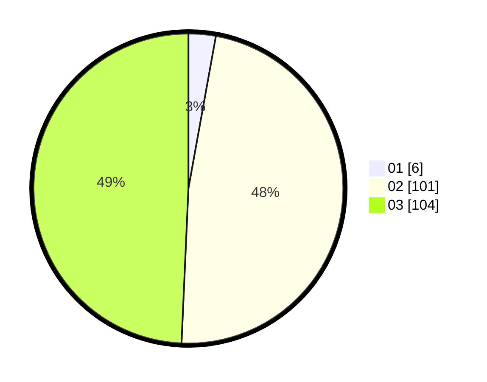

# Hasil

Hasil perolehan suara paslon dapat dilihat pada file paslon-01.txt, paslon-02.txt, dan paslon-03.txt.

Jika tidak ada, artinya data tersebut belum ada pada SIREKAP.

## Perolehan Suara

 * Paslon 01: **6**.
 * Paslon 02: **101**.
 * Paslon 03: **104**.

## Foto C Plano

https://sirekap-obj-formc.kpu.go.id/74dd/pemilu/ppwp/31/73/01/10/02/3173011002189-20240214-205110--9a37a8e1-e7b8-4bc4-9807-47ad10f046c8.jpg

https://sirekap-obj-formc.kpu.go.id/74dd/pemilu/ppwp/31/73/01/10/02/3173011002189-20240214-203417--ed6f9186-8ed2-4797-b43e-4ce092d640be.jpg

https://sirekap-obj-formc.kpu.go.id/74dd/pemilu/ppwp/31/73/01/10/02/3173011002189-20240214-203443--4086d08f-7632-475a-91a7-a2820cc4b796.jpg
