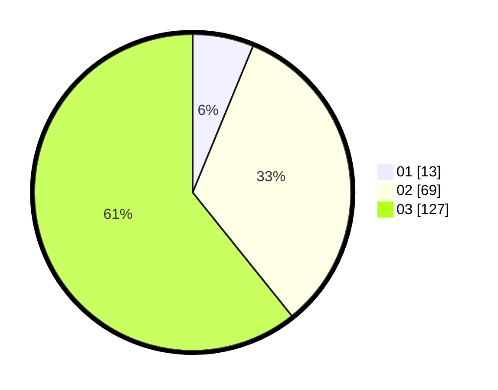

# Hasil

Hasil perolehan suara paslon dapat dilihat pada file paslon-01.txt, paslon-02.txt, dan paslon-03.txt.

Jika tidak ada, artinya data tersebut belum ada pada SIREKAP.

## Perolehan Suara

 * Paslon 01: **13**.
 * Paslon 02: **69**.
 * Paslon 03: **127**.

## Foto C Plano

https://sirekap-obj-formc.kpu.go.id/f536/pemilu/ppwp/31/73/01/10/02/3173011002191-20240214-215335--6514e2b7-7692-454c-a5a5-e8d20e24e9b3.jpg

https://sirekap-obj-formc.kpu.go.id/f536/pemilu/ppwp/31/73/01/10/02/3173011002191-20240214-215556--b73d9536-398d-43c3-915b-06461e269d96.jpg

https://sirekap-obj-formc.kpu.go.id/f536/pemilu/ppwp/31/73/01/10/02/3173011002191-20240214-215753--0a4a0d39-0f29-41dc-8e7c-ac9051694a17.jpg
