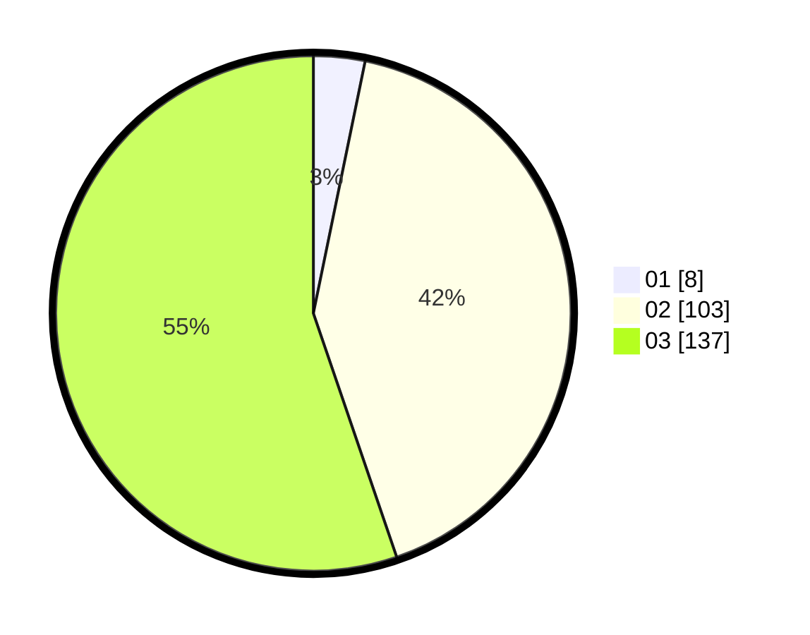

# Hasil

Hasil perolehan suara paslon dapat dilihat pada file paslon-01.txt, paslon-02.txt, dan paslon-03.txt.

Jika tidak ada, artinya data tersebut belum ada pada SIREKAP.

## Perolehan Suara

 * Paslon 01: **8**.
 * Paslon 02: **103**.
 * Paslon 03: **137**.

## Foto C Plano

https://sirekap-obj-formc.kpu.go.id/8897/pemilu/ppwp/31/73/01/10/02/3173011002193-20240214-155717--132324df-dba5-4b74-bf5b-702cbbd34a88.jpg

https://sirekap-obj-formc.kpu.go.id/8897/pemilu/ppwp/31/73/01/10/02/3173011002193-20240214-155837--d0ac7106-5afd-446e-900e-6edeb8e10355.jpg

https://sirekap-obj-formc.kpu.go.id/8897/pemilu/ppwp/31/73/01/10/02/3173011002193-20240214-160058--49a2da39-670a-43e8-8eae-4477366b1faf.jpg
