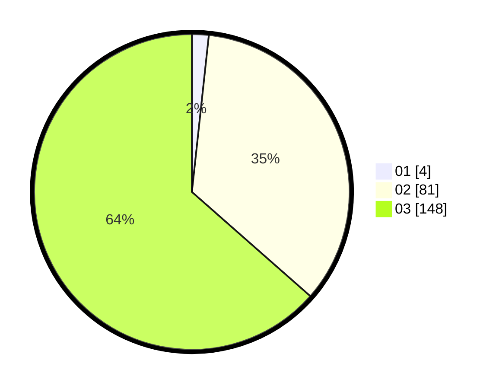

# Hasil

Hasil perolehan suara paslon dapat dilihat pada file paslon-01.txt, paslon-02.txt, dan paslon-03.txt.

Jika tidak ada, artinya data tersebut belum ada pada SIREKAP.

## Perolehan Suara

 * Paslon 01: **4**.
 * Paslon 02: **81**.
 * Paslon 03: **148**.

## Foto C Plano

https://sirekap-obj-formc.kpu.go.id/3ba5/pemilu/ppwp/31/73/01/10/02/3173011002203-20240216-152125--d1854b60-37f5-4ed1-8ca9-0b43c34e2116.jpg

https://sirekap-obj-formc.kpu.go.id/3ba5/pemilu/ppwp/31/73/01/10/02/3173011002203-20240216-152126--0d00a5e4-e828-453b-be7d-ece4bbce00ea.jpg

https://sirekap-obj-formc.kpu.go.id/3ba5/pemilu/ppwp/31/73/01/10/02/3173011002203-20240214-204055--05fe6b64-ed7e-48f9-9d2d-7770b2818c00.jpg

## DATA PEMILIH TETAP

Jumlah pemilih dalam DPT: **271**.
 * L: **133**.
 * P: **138**.

## DATA PENGGUNA HAK PILIH

Jumlah pengguna hak pilih dalam DPT: **218**.
 * L: **110**.
 * P: **108**.

Jumlah pengguna hak pilih dalam DPTb: **13**.
 * L: **3**.
 * P: **10**.

Jumlah pengguna hak pilih dalam DPK: **8**.
 * L: **3**.
 * P: **5**.

Jumlah pengguna hak pilih: **239**.
 * L: **116**.
 * P: **123**.

## JUMLAH SUARA SAH DAN TIDAK SAH

JUMLAH SELURUH SUARA SAH: **233**.

JUMLAH SUARA TIDAK SAH: **6**.

JUMLAH SELURUH SUARA SAH DAN SUARA TIDAK SAH: **239**.
