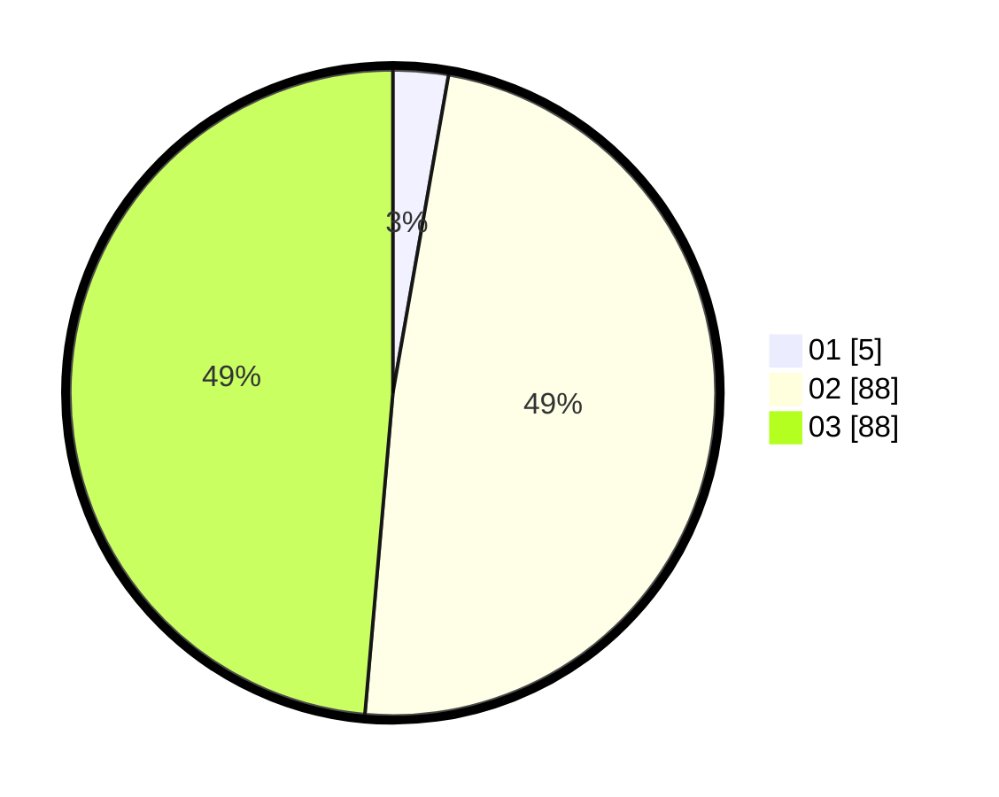

# Hasil

Hasil perolehan suara paslon dapat dilihat pada file paslon-01.txt, paslon-02.txt, dan paslon-03.txt.

Jika tidak ada, artinya data tersebut belum ada pada SIREKAP.

## Perolehan Suara

 * Paslon 01: **5**.
 * Paslon 02: **88**.
 * Paslon 03: **88**.

## Foto C Plano

https://sirekap-obj-formc.kpu.go.id/2050/pemilu/ppwp/31/73/01/10/02/3173011002206-20240214-210834--219ab6e2-068d-4f94-821f-6a6a3cab22d0.jpg

https://sirekap-obj-formc.kpu.go.id/2050/pemilu/ppwp/31/73/01/10/02/3173011002206-20240214-202737--a22ca458-05af-4727-8486-5007c2784259.jpg

https://sirekap-obj-formc.kpu.go.id/2050/pemilu/ppwp/31/73/01/10/02/3173011002206-20240214-210925--24342de9-b0ef-48da-9c7b-f8de7753e5c2.jpg

## DATA PEMILIH TETAP

Jumlah pemilih dalam DPT: **217**.
 * L: **104**.
 * P: **113**.

## DATA PENGGUNA HAK PILIH

Jumlah pengguna hak pilih dalam DPT: **183**.
 * L: **88**.
 * P: **95**.

Jumlah pengguna hak pilih dalam DPTb: **1**.
 * L: **1**.
 * P: **0**.

Jumlah pengguna hak pilih dalam DPK: **1**.
 * L: **0**.
 * P: **1**.

Jumlah pengguna hak pilih: **185**.
 * L: **89**.
 * P: **96**.

## JUMLAH SUARA SAH DAN TIDAK SAH

JUMLAH SELURUH SUARA SAH: **181**.

JUMLAH SUARA TIDAK SAH: **4**.

JUMLAH SELURUH SUARA SAH DAN SUARA TIDAK SAH: **185**.
