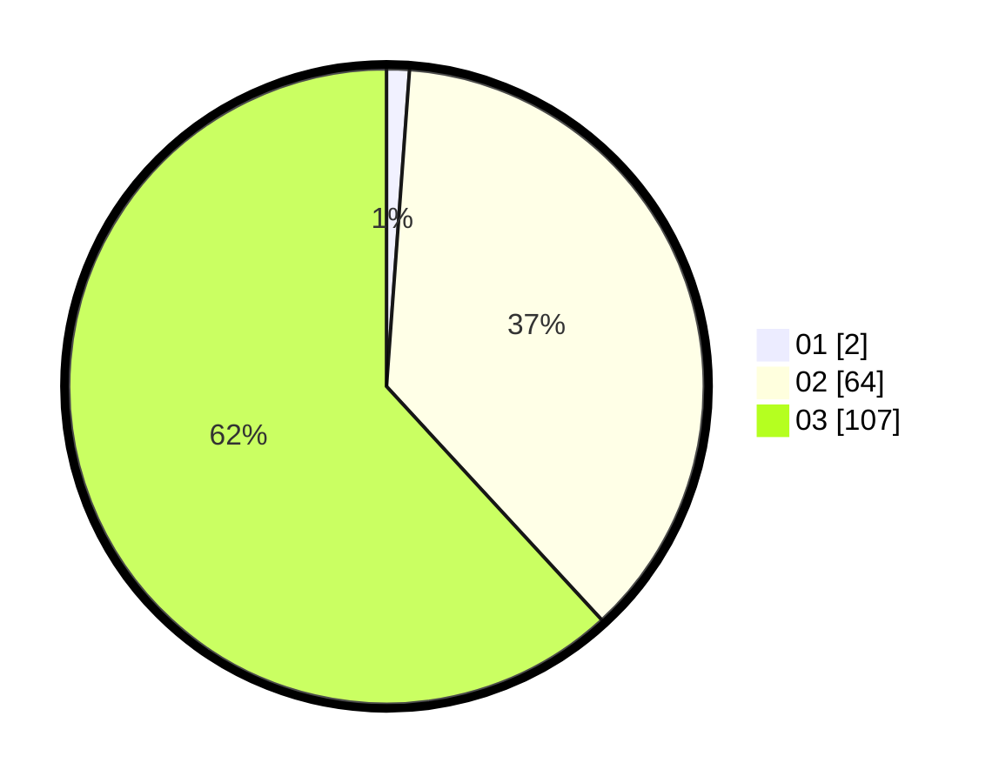

# Hasil

Hasil perolehan suara paslon dapat dilihat pada file paslon-01.txt, paslon-02.txt, dan paslon-03.txt.

Jika tidak ada, artinya data tersebut belum ada pada SIREKAP.

## Perolehan Suara

 * Paslon 01: **2**.
 * Paslon 02: **64**.
 * Paslon 03: **107**.

## Foto C Plano

https://sirekap-obj-formc.kpu.go.id/8ac9/pemilu/ppwp/31/73/01/10/02/3173011002207-20240214-225959--0d2f3ab5-b752-4ffc-be45-312c4a9b90c3.jpg

https://sirekap-obj-formc.kpu.go.id/8ac9/pemilu/ppwp/31/73/01/10/02/3173011002207-20240214-210501--4cadac64-fc9e-4e72-8673-f9c1ff9020d8.jpg

https://sirekap-obj-formc.kpu.go.id/8ac9/pemilu/ppwp/31/73/01/10/02/3173011002207-20240214-210814--9106a48f-0502-45b1-8568-18caf6822cf5.jpg
