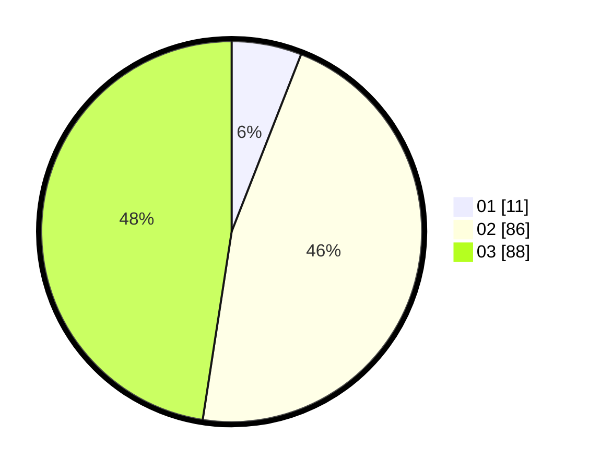

# Hasil

Hasil perolehan suara paslon dapat dilihat pada file paslon-01.txt, paslon-02.txt, dan paslon-03.txt.

Jika tidak ada, artinya data tersebut belum ada pada SIREKAP.

## Perolehan Suara

 * Paslon 01: **11**.
 * Paslon 02: **86**.
 * Paslon 03: **88**.

## Foto C Plano

https://sirekap-obj-formc.kpu.go.id/197a/pemilu/ppwp/31/73/01/10/02/3173011002210-20240215-205201--673103b3-f482-4dd9-9bfb-ef4460a2ea62.jpg

https://sirekap-obj-formc.kpu.go.id/197a/pemilu/ppwp/31/73/01/10/02/3173011002210-20240215-205203--0569413d-8d42-4181-8408-a855e9a1cad5.jpg

https://sirekap-obj-formc.kpu.go.id/197a/pemilu/ppwp/31/73/01/10/02/3173011002210-20240215-205202--8e7c9997-b97b-4653-a98f-c21148a5e6ad.jpg

## DATA PEMILIH TETAP

Jumlah pemilih dalam DPT: **277**.
 * L: **136**.
 * P: **141**.

## DATA PENGGUNA HAK PILIH

Jumlah pengguna hak pilih dalam DPT: **189**.
 * L: **98**.
 * P: **91**.

Jumlah pengguna hak pilih dalam DPTb: **5**.
 * L: **3**.
 * P: **2**.

Jumlah pengguna hak pilih dalam DPK: **3**.
 * L: **1**.
 * P: **2**.

Jumlah pengguna hak pilih: **197**.
 * L: **102**.
 * P: **95**.

## JUMLAH SUARA SAH DAN TIDAK SAH

JUMLAH SELURUH SUARA SAH: **185**.

JUMLAH SUARA TIDAK SAH: **4**.

JUMLAH SELURUH SUARA SAH DAN SUARA TIDAK SAH: **189**.
