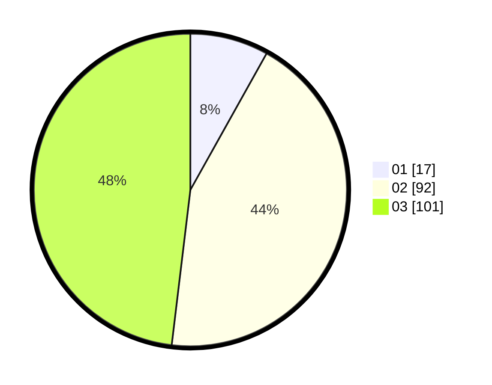

# Hasil

Hasil perolehan suara paslon dapat dilihat pada file paslon-01.txt, paslon-02.txt, dan paslon-03.txt.

Jika tidak ada, artinya data tersebut belum ada pada SIREKAP.

## Perolehan Suara

 * Paslon 01: **17**.
 * Paslon 02: **92**.
 * Paslon 03: **101**.

## Foto C Plano

https://sirekap-obj-formc.kpu.go.id/09a7/pemilu/ppwp/31/73/01/10/02/3173011002211-20240214-141505--c015d3bf-5517-408d-ac09-681e5a614b57.jpg

https://sirekap-obj-formc.kpu.go.id/09a7/pemilu/ppwp/31/73/01/10/02/3173011002211-20240215-184225--8605d253-f86a-4468-adca-d576626f92ee.jpg

https://sirekap-obj-formc.kpu.go.id/09a7/pemilu/ppwp/31/73/01/10/02/3173011002211-20240215-184214--ebb8dfb0-5c83-427e-b3e8-55384e5be488.jpg

## DATA PEMILIH TETAP

Jumlah pemilih dalam DPT: **280**.
 * L: **138**.
 * P: **142**.

## DATA PENGGUNA HAK PILIH

Jumlah pengguna hak pilih dalam DPT: **209**.
 * L: **97**.
 * P: **112**.

Jumlah pengguna hak pilih dalam DPTb: **2**.
 * L: **1**.
 * P: **1**.

Jumlah pengguna hak pilih dalam DPK: **1**.
 * L: **0**.
 * P: **1**.

Jumlah pengguna hak pilih: **212**.
 * L: **98**.
 * P: **114**.

## JUMLAH SUARA SAH DAN TIDAK SAH

JUMLAH SELURUH SUARA SAH: **210**.

JUMLAH SUARA TIDAK SAH: **2**.

JUMLAH SELURUH SUARA SAH DAN SUARA TIDAK SAH: **212**.
