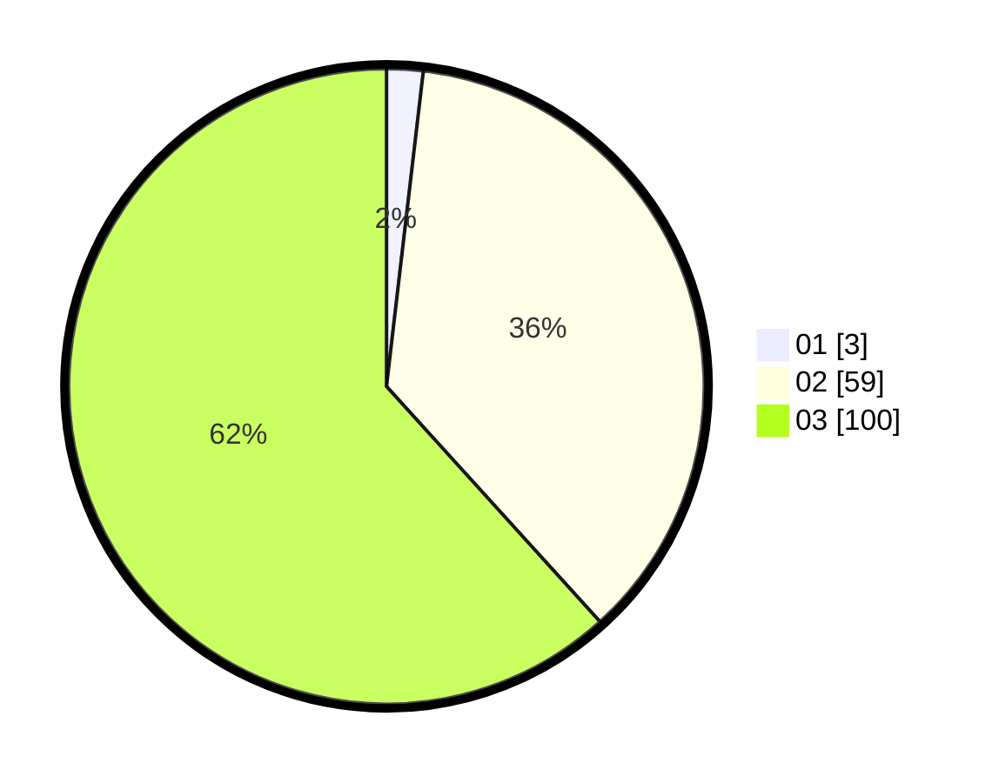

# Hasil

Hasil perolehan suara paslon dapat dilihat pada file paslon-01.txt, paslon-02.txt, dan paslon-03.txt.

Jika tidak ada, artinya data tersebut belum ada pada SIREKAP.

## Perolehan Suara

 * Paslon 01: **3**.
 * Paslon 02: **59**.
 * Paslon 03: **100**.

## Foto C Plano

https://sirekap-obj-formc.kpu.go.id/43e3/pemilu/ppwp/31/73/01/10/02/3173011002214-20240215-120950--aed04d45-0cb1-483e-9084-ec43486197ab.jpg

https://sirekap-obj-formc.kpu.go.id/43e3/pemilu/ppwp/31/73/01/10/02/3173011002214-20240215-121012--87797f77-dc38-471b-bb6c-02f293114e07.jpg

https://sirekap-obj-formc.kpu.go.id/43e3/pemilu/ppwp/31/73/01/10/02/3173011002214-20240215-121001--31b45450-ae01-4118-ba57-47cb6a7bbe50.jpg

## DATA PEMILIH TETAP

Jumlah pemilih dalam DPT: **160**.
 * L: **79**.
 * P: **81**.

## DATA PENGGUNA HAK PILIH

Jumlah pengguna hak pilih dalam DPT: **160**.
 * L: **79**.
 * P: **81**.

Jumlah pengguna hak pilih dalam DPTb: **5**.
 * L: **1**.
 * P: **4**.

Jumlah pengguna hak pilih dalam DPK: **0**.
 * L: **0**.
 * P: **0**.

Jumlah pengguna hak pilih: **165**.
 * L: **80**.
 * P: **85**.

## JUMLAH SUARA SAH DAN TIDAK SAH

JUMLAH SELURUH SUARA SAH: **162**.

JUMLAH SUARA TIDAK SAH: **3**.

JUMLAH SELURUH SUARA SAH DAN SUARA TIDAK SAH: **165**.
