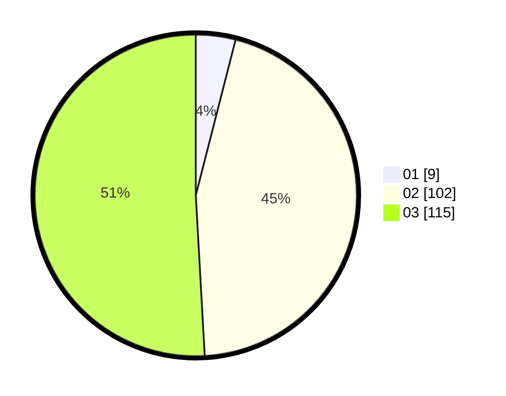

# Hasil

Hasil perolehan suara paslon dapat dilihat pada file paslon-01.txt, paslon-02.txt, dan paslon-03.txt.

Jika tidak ada, artinya data tersebut belum ada pada SIREKAP.

## Perolehan Suara

 * Paslon 01: **9**.
 * Paslon 02: **102**.
 * Paslon 03: **115**.

## Foto C Plano

https://sirekap-obj-formc.kpu.go.id/6d57/pemilu/ppwp/31/73/01/10/02/3173011002219-20240215-053240--678a492a-83c7-46e3-9c08-b15866117451.jpg

https://sirekap-obj-formc.kpu.go.id/6d57/pemilu/ppwp/31/73/01/10/02/3173011002219-20240215-054055--91ad4394-367c-4f24-98c8-9b94182f02a6.jpg

https://sirekap-obj-formc.kpu.go.id/6d57/pemilu/ppwp/31/73/01/10/02/3173011002219-20240215-054207--1aff43c5-4d20-4f18-a723-b8ff7dac9c50.jpg
