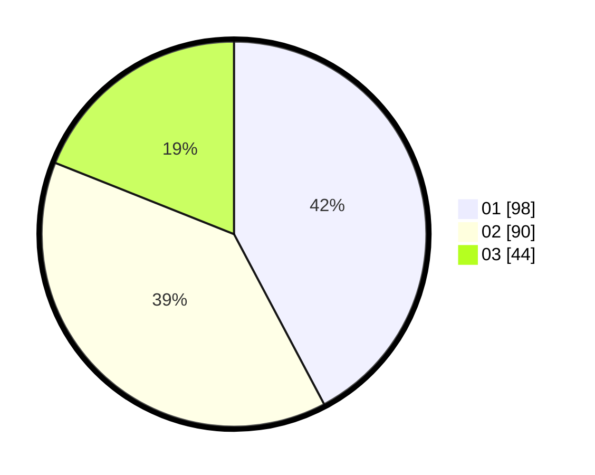

# Hasil

Hasil perolehan suara paslon dapat dilihat pada file paslon-01.txt, paslon-02.txt, dan paslon-03.txt.

Jika tidak ada, artinya data tersebut belum ada pada SIREKAP.

## Perolehan Suara

 * Paslon 01: **98**.
 * Paslon 02: **90**.
 * Paslon 03: **44**.

## Foto C Plano

https://sirekap-obj-formc.kpu.go.id/95df/pemilu/ppwp/31/73/01/10/02/3173011002221-20240214-155612--53b2d4ac-9d9d-419b-8349-a972b1f4ad25.jpg

https://sirekap-obj-formc.kpu.go.id/95df/pemilu/ppwp/31/73/01/10/02/3173011002221-20240214-155750--c7457f29-6084-45da-9372-caf74c129c60.jpg

https://sirekap-obj-formc.kpu.go.id/95df/pemilu/ppwp/31/73/01/10/02/3173011002221-20240214-155901--2a2b62f7-eaa5-464c-85ce-e2ccccf9c658.jpg
