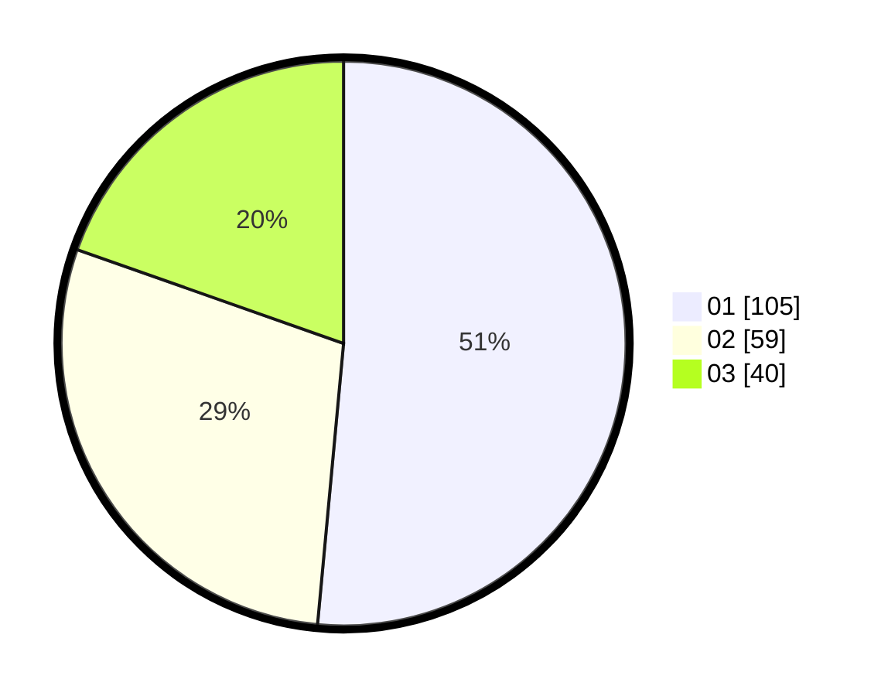

# Hasil

Hasil perolehan suara paslon dapat dilihat pada file paslon-01.txt, paslon-02.txt, dan paslon-03.txt.

Jika tidak ada, artinya data tersebut belum ada pada SIREKAP.

## Perolehan Suara

 * Paslon 01: **105**.
 * Paslon 02: **59**.
 * Paslon 03: **40**.

## Foto C Plano

https://sirekap-obj-formc.kpu.go.id/e770/pemilu/ppwp/31/73/01/10/02/3173011002222-20240216-011414--bc07ee39-fcf9-43ca-953e-a1116a045857.jpg

https://sirekap-obj-formc.kpu.go.id/e770/pemilu/ppwp/31/73/01/10/02/3173011002222-20240216-011426--36b3181e-d2f0-451a-922c-bb080ac84d9f.jpg

https://sirekap-obj-formc.kpu.go.id/e770/pemilu/ppwp/31/73/01/10/02/3173011002222-20240216-011418--a88089dc-f1cc-48ae-9444-be55b55eeed6.jpg

## DATA PEMILIH TETAP

Jumlah pemilih dalam DPT: **280**.
 * L: **132**.
 * P: **148**.

## DATA PENGGUNA HAK PILIH

Jumlah pengguna hak pilih dalam DPT: **198**.
 * L: **93**.
 * P: **105**.

Jumlah pengguna hak pilih dalam DPTb: **8**.
 * L: **4**.
 * P: **4**.

Jumlah pengguna hak pilih dalam DPK: **0**.
 * L: **0**.
 * P: **0**.

Jumlah pengguna hak pilih: **206**.
 * L: **97**.
 * P: **109**.

## JUMLAH SUARA SAH DAN TIDAK SAH

JUMLAH SELURUH SUARA SAH: **204**.

JUMLAH SUARA TIDAK SAH: **2**.

JUMLAH SELURUH SUARA SAH DAN SUARA TIDAK SAH: **206**.
