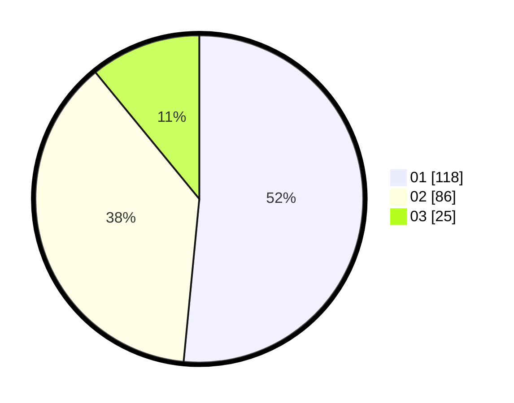

# Hasil

Hasil perolehan suara paslon dapat dilihat pada file paslon-01.txt, paslon-02.txt, dan paslon-03.txt.

Jika tidak ada, artinya data tersebut belum ada pada SIREKAP.

## Perolehan Suara

 * Paslon 01: **118**.
 * Paslon 02: **86**.
 * Paslon 03: **25**.

## Foto C Plano

https://sirekap-obj-formc.kpu.go.id/2b96/pemilu/ppwp/31/73/01/10/02/3173011002225-20240216-014906--07a5a9cf-2d05-4593-88fc-24606a2919d0.jpg

https://sirekap-obj-formc.kpu.go.id/2b96/pemilu/ppwp/31/73/01/10/02/3173011002225-20240216-014915--93b6b39f-e6b9-4399-b3ff-31126db1241c.jpg

https://sirekap-obj-formc.kpu.go.id/2b96/pemilu/ppwp/31/73/01/10/02/3173011002225-20240216-014907--c08e7d0d-a8ae-42b7-8069-907466996711.jpg

## DATA PEMILIH TETAP

Jumlah pemilih dalam DPT: **275**.
 * L: **145**.
 * P: **130**.

## DATA PENGGUNA HAK PILIH

Jumlah pengguna hak pilih dalam DPT: **226**.
 * L: **119**.
 * P: **107**.

Jumlah pengguna hak pilih dalam DPTb: **4**.
 * L: **2**.
 * P: **2**.

Jumlah pengguna hak pilih dalam DPK: **6**.
 * L: **4**.
 * P: **2**.

Jumlah pengguna hak pilih: **236**.
 * L: **125**.
 * P: **111**.

## JUMLAH SUARA SAH DAN TIDAK SAH

JUMLAH SELURUH SUARA SAH: **229**.

JUMLAH SUARA TIDAK SAH: **7**.

JUMLAH SELURUH SUARA SAH DAN SUARA TIDAK SAH: **236**.
