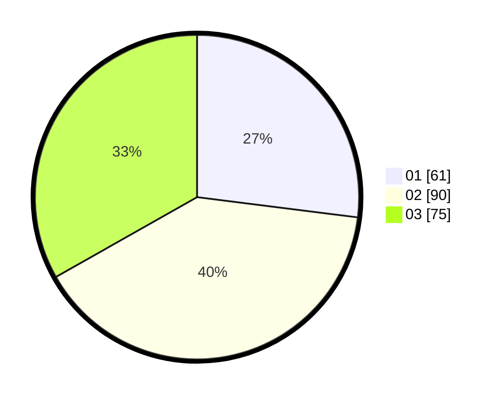

# Hasil

Hasil perolehan suara paslon dapat dilihat pada file paslon-01.txt, paslon-02.txt, dan paslon-03.txt.

Jika tidak ada, artinya data tersebut belum ada pada SIREKAP.

## Perolehan Suara

 * Paslon 01: **61**.
 * Paslon 02: **90**.
 * Paslon 03: **75**.

## Foto C Plano

https://sirekap-obj-formc.kpu.go.id/9513/pemilu/ppwp/31/73/01/10/02/3173011002230-20240216-144959--829cb770-f05e-493e-add6-a438146d2e36.jpg

https://sirekap-obj-formc.kpu.go.id/9513/pemilu/ppwp/31/73/01/10/02/3173011002230-20240216-145000--00299698-86a3-45ee-bec6-2e00187c9650.jpg

https://sirekap-obj-formc.kpu.go.id/9513/pemilu/ppwp/31/73/01/10/02/3173011002230-20240216-145000--8dd66047-c478-4b24-956f-9bb879c836d8.jpg

## DATA PEMILIH TETAP

Jumlah pemilih dalam DPT: **0**.
 * L: **0**.
 * P: **0**.

## DATA PENGGUNA HAK PILIH

Jumlah pengguna hak pilih dalam DPT: **0**.
 * L: **0**.
 * P: **0**.

Jumlah pengguna hak pilih dalam DPTb: **0**.
 * L: **0**.
 * P: **0**.

Jumlah pengguna hak pilih dalam DPK: **0**.
 * L: **0**.
 * P: **0**.

Jumlah pengguna hak pilih: **0**.
 * L: **0**.
 * P: **0**.

## JUMLAH SUARA SAH DAN TIDAK SAH

JUMLAH SELURUH SUARA SAH: **226**.

JUMLAH SUARA TIDAK SAH: **2**.

JUMLAH SELURUH SUARA SAH DAN SUARA TIDAK SAH: **228**.
