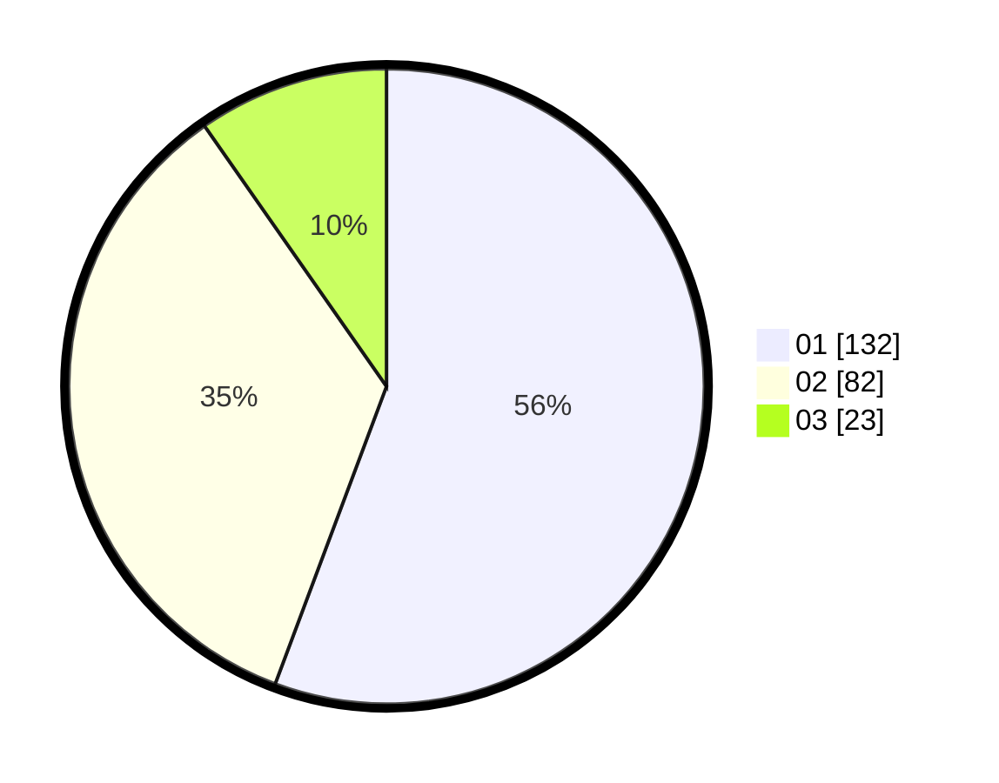

# Hasil

Hasil perolehan suara paslon dapat dilihat pada file paslon-01.txt, paslon-02.txt, dan paslon-03.txt.

Jika tidak ada, artinya data tersebut belum ada pada SIREKAP.

## Perolehan Suara

 * Paslon 01: **132**.
 * Paslon 02: **82**.
 * Paslon 03: **23**.

## Foto C Plano

https://sirekap-obj-formc.kpu.go.id/5fa7/pemilu/ppwp/31/73/01/10/02/3173011002232-20240214-225441--793375f3-281f-4893-9465-ef29c402886b.jpg

https://sirekap-obj-formc.kpu.go.id/5fa7/pemilu/ppwp/31/73/01/10/02/3173011002232-20240214-225823--87e2db5e-c390-4612-aaa8-b6fa9ce83d76.jpg

https://sirekap-obj-formc.kpu.go.id/5fa7/pemilu/ppwp/31/73/01/10/02/3173011002232-20240214-202013--6a74d4b9-2df7-4e21-bf47-2cbbc0b51b44.jpg
